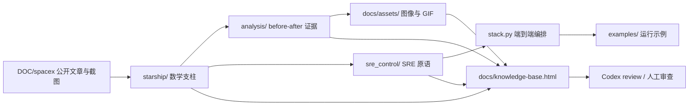
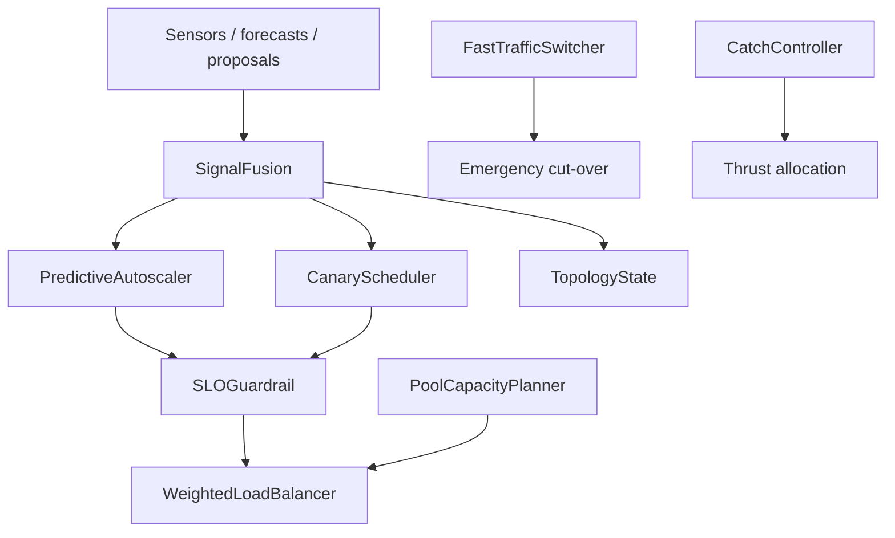
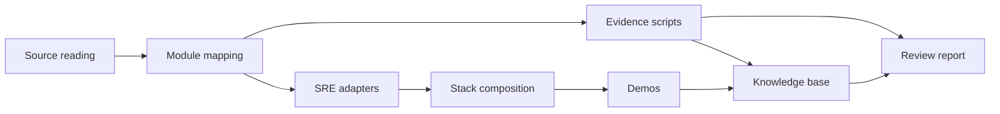

# SpaceX → SRE Architecture

本文把 `spacex/` 这套工程拆成一份更偏“系统设计”的说明，重点回答四件事：

1. 架构长什么样
2. 需要满足什么要求
3. 应该怎么拆任务
4. 应该怎么逐轮 refine

它不是再讲一遍公式，而是把 `starship/`、`sre_control/`、`analysis/`、`docs/` 这些层的职责、边界、依赖和验收标准讲清楚。

---

## 1. Architecture

### 1.1 System Shape

### 1.2 Layers

| 层 | 目录 | 职责 | 产物 |
|---|---|---|---|
| 源材料层 | `DOC/spacex/` | 只读公开材料 | OCR 截图、原始叙述 |
| 数学实现层 | `starship/` | 把 8 个支柱落成可运行代码 | 控制、估计、约束、分配器 |
| 证据层 | `analysis/` | 证明 before/after 的收益 | PNG、SUMMARY.txt |
| 迁移层 | `sre_control/` | 把星舰原语翻译成 SRE 控制原语 | pool / canary / fusion / autoscaler / guardrail |
| 编排层 | `sre_control/stack.py` | 串联成一个控制循环 | `SREControlStack.step()` |
| 场景层 | `examples/` | 给人看、给审查跑的场景 | demo 脚本 |
| 知识层 | `docs/` | 把机制、公式、图、GIF 放在一个可审查入口 | HTML 知识库、报告 |
| 质量层 | `tests/` | 保证边界条件和数值行为 | 单元测试 |

### 1.3 Control Flow

一条典型的 tick 经过这条链：

1. `SignalFusion` 融合观测。
2. `PredictiveAutoscaler` 计算下一拍副本数。
3. `CanaryScheduler` 在灰度半径里推进。
4. `SLOGuardrail` 把不安全 proposal 投影回可行集。
5. `WeightedLoadBalancer` 在 box 约束下分配负载。
6. `FastTrafficSwitcher` 只在紧急情形下进入 bang-bang。
7. `PoolCapacityPlanner` 和 `TopologyState` 作为静态约束与状态底座存在。

### 1.4 Data Flow

输入不是单一状态，而是四类信息：

- 观测：metrics / trace / RUM / radar-like sensors
- 预测：forecast_rps / future trajectory
- 约束：capacity / cone / box / SLO / trust region
- 目标：replicas / traffic split / wrench / latency budget

输出也不是单一动作，而是：

- fused state
- next decision
- safety audit
- allocation result
- trace for review

### 1.5 Module Contract Matrix

| Module | Input | Output | Persistent state | Invariants | Common failure mode |
|---|---|---|---|---|---|
| `PoolCapacityPlanner` | demand forecast | pool sizes + cost info | none | `min_keep_alive <= pool <= max_capacity` | demand too low/high makes the relaxation look trivial |
| `CanaryScheduler` | current share + observed error | next share + trust region | slope estimate + eta | trust region stays within `[eta_min, eta_max]` | bad local model shrinks/grows too aggressively |
| `TopologyState` | velocity + angular velocity | updated position + quaternion | position + q + omega | quaternion norm stays near 1 | Euler-style updates leak drift |
| `SLOGuardrail` | candidate action | approved action + audit | cone filter config | approved action lies in cone and box | proposal points outside cone or exceeds magnitude |
| `SignalFusion` | sensor list | fused state + covariance trace | EKF posterior | covariance must remain PSD-ish | noise model mismatch poisons posterior |
| `PredictiveAutoscaler` | current replicas + observed/forecast RPS | next integer replica count | internal MPC warm-start | output must stay in bounds | too-short horizon or bad scaling causes chatter |
| `FastTrafficSwitcher` | share_from, share_to | time grid + bang-bang profile | none | monotone two-phase switch profile | rate cap too tight makes switch slow |
| `WeightedLoadBalancer` | demand + zone target | bounded share vector + residual | none | per-instance box constraints satisfied | pseudo-inverse would violate boxes |
| `CatchController` | 6-DoF state + target | thrust vector + residuals | inner allocator | thrust magnitudes obey bounds | poor geometry / rank loss makes residual large |

### 1.6 Dependency and Degradation Order

The control stack is intentionally layered so that higher-level planners can fail without destroying the safety rails below them.

Degradation policy:

1. If prediction is weak, keep guardrails and allocators active, but reduce horizon.
2. If fusion is weak, fall back to the last credible estimate plus conservative bounds.
3. If canary confidence is weak, freeze rollout instead of pushing forward.
4. If allocation is ill-conditioned, prefer residual-safe bounded LS over exact matching.
5. If emergency logic triggers, use the bang-bang switcher and suppress soft optimizers.

---

## 2. Requirements

### 2.1 Functional Requirements

| ID | Requirement | Why it matters |
|---|---|---|
| FR-1 | 每个数学支柱必须有对应 Python 模块 | 方便单独验证和复用 |
| FR-2 | 每个支柱必须能给出 before / after 证据 | 让收益可量化 |
| FR-3 | SRE 侧必须有一一对应的原语适配层 | 让迁移不是“比喻”，而是接口映射 |
| FR-4 | 端到端栈必须能串联运行 | 证明原语能复利而不是只会单点出结果 |
| FR-5 | 知识库必须能离线阅读 | 审查时不依赖外部链接 |
| FR-6 | 每个模块必须有边界测试 | 保护数值稳定性和约束行为 |

### 2.2 Non-Functional Requirements

| ID | Requirement | Target |
|---|---|---|
| NFR-1 | 可复现 | 固定 seed、固定输入、固定输出 |
| NFR-2 | 可审查 | 文档、图、公式、代码三层对齐 |
| NFR-3 | 数值稳健 | 约束投影、Joseph form、warm-start 等 |
| NFR-4 | 可扩展 | 新支柱可以按同一模板加入 |
| NFR-5 | 低依赖 | 以 numpy / scipy 为主，避免重型外部栈 |
| NFR-6 | 可回退 | 单模块失效时能降级，不破坏整体接口 |

### 2.3 Quality Gates

- `pytest tests -q` 通过
- `python -m analysis.run_all` 通过
- `python -m scripts.build_kb` 通过
- `python -m examples.demo_sre_loop` 通过
- 关键 before/after 数字可从 `analysis/artifacts/SUMMARY.txt` 复现

### 2.4 Traceability Rules

Every requirement needs a concrete place where it can be checked:

- math requirement -> equation in `FORMULA_MAP.md`
- behaviour requirement -> unit test in `tests/`
- benefit requirement -> `analysis/sXX_*.py`
- packaging requirement -> `docs/knowledge-base.html`
- architecture requirement -> this file

If a requirement cannot be traced to one of the above, it is probably too vague.

---

## 3. Task Breakdown

### 3.1 Epic A: Source-to-Module Mapping

目标：把公开材料中的 8 个支柱变成可运行实现。

任务：

1. 提取每个支柱的状态、约束、目标函数。
2. 给每个支柱写最小可运行模块。
3. 为每个模块定义输入输出协议。
4. 给每个模块补单元测试。

### 3.2 Epic B: Before/After Evidence

目标：证明每个模块不只是“能跑”，而是“比朴素方案好”。

任务：

1. 为每个支柱定义 baseline。
2. 为每个支柱定义 after 方案。
3. 固定 seed 和场景。
4. 输出 summary 和对比图。

### 3.3 Epic C: SRE Translation

目标：把星舰原语迁移成 SRE 原语。

任务：

1. 建立 SRE 语义表。
2. 为每个 starship 模块编写 SRE adapter。
3. 明确哪些约束是硬约束，哪些是目标项。
4. 给每个映射写 counter-example。

### 3.4 Epic D: End-to-End Composition

目标：让单点原语变成一条闭环。

任务：

1. 串联 observe / predict / guard / allocate / execute。
2. 设计 brown-out、surge、rollback 等复合场景。
3. 检查跨模块误差传播。
4. 观察资源成本与稳定性的 trade-off。

### 3.5 Epic E: Knowledge Packaging

目标：让结果可以被人和 Codex 快速审查。

任务：

1. 机制图替代 OCR 截图。
2. GIF 展示动态收益。
3. HTML 收敛为单入口知识库。
4. Codex review report 固化检查点。

### 3.6 Task Dependency Graph

The work does not proceed linearly; it fans out and then recombines.

Practical ordering:

1. Read source and pin the equations.
2. Build the narrow module.
3. Write one baseline and one after path.
4. Verify with tests.
5. Package into docs.
6. Only then widen into SRE composition.

---

## 4. Refine Loop

这是最重要的部分。不是一次性写完，而是按同一套 refine 节奏前进。

### 4.1 Refine Order

1. 先把数学定义对齐。
2. 再把 baseline 定清楚。
3. 再把 after 实现做出来。
4. 再看证据是否真的赢。
5. 再补边界和数值问题。
6. 最后才做知识库包装。

### 4.2 Refine Questions

每轮都问自己这 6 个问题：

- 这个模块的状态是否定义完整？
- 约束是不是硬的，还是被误写成了目标？
- baseline 是否公平？
- after 的收益是否来自真正机制，而不是场景偏置？
- 有没有边界输入会把模块打坏？
- 这个模块能否被 SRE 语义无损迁移？

### 4.3 Refine Acceptance Criteria

一个模块算“够用”，至少要满足：

- 能独立运行
- 能给出 before / after
- 能被 SRE 解释
- 能指出 counter-example
- 能经受边界测试

### 4.4 Refine Priorities

优先级从高到低：

1. correctness
2. constraint handling
3. numerical stability
4. evidence quality
5. docs polish

### 4.5 Refine Backlog

The next useful refinements are:

1. Add counter-examples to each SRE adapter.
2. Add explicit failure-state traces to `analysis/`.
3. Split `SREControlStack` into observable sub-steps if future users need per-stage audits.
4. Add a contract test for every public dataclass field.
5. Add one "do not use this when..." note per module to keep the abstraction honest.

---

## 5. Recommended Next Tasks

1. 为每个 SRE 原语补一个 counter-example。
2. 在 `knowledge-base.html` 里把架构图和任务分解索引化。
3. 给 `stack.py` 增加更清晰的降级路径说明。
4. 如果要继续做工程化，下一步应该补“接口契约”而不是再加更多图。
