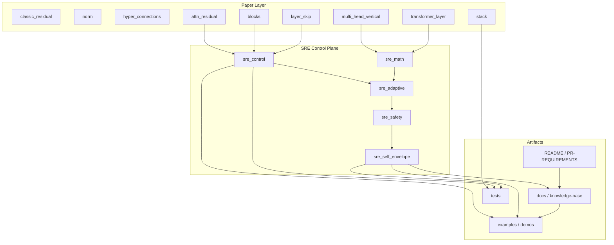

# Attention-Residuals Architecture

> 这份文档把当前仓库从“论文实现 + SRE 原语 + 自学习外壳”整理成一张工程架构图。
> 目标不是再解释一次 Attention Residuals，而是把它们如何被复用成一个可落地的 SRE 控制平台说清楚。

---

## 1. Architecture

### 1.1 核心分层

### 1.2 数据流

1. 论文层提供基础机制。
2. `sre_control` 把机制抽象成领域无关控制原语。
3. `sre_adaptive` 给控制原语加闭环学习，但不破坏硬约束。
4. `sre_safety` 给动作空间加外壳、影子模式、反事实解释、漂移检测。
5. `sre_self_envelope` 让外壳从 audit trail 中自学习。
6. `docs` 和 `examples` 负责把“原理 -> 代码 -> 运行证据”连起来。

---

## 2. Requirements

### 2.1 Functional requirements

| ID | Requirement | Source module |
| --- | --- | --- |
| FR-1 | 支持 `CLASSIC / HYPER / MANIFOLD_HYPER / FULL_ATTN_RES / BLOCK_ATTN_RES / MULTI_HEAD_ATTN_RES` 六种残差策略 | `stack.py` |
| FR-2 | 支持纵向注意力 `AttnRes_l = sum(a_k x_k)`，并暴露 `last_weights()` | `attn_residual.py` |
| FR-3 | 支持 Block 分段，控制复杂度从 `O(L^2)` 降到 `O((L/B)^2 + L)` | `blocks.py` |
| FR-4 | 支持多头纵向注意力和层跳过门控 | `multi_head_vertical.py`, `layer_skip.py` |
| FR-5 | 支持凸组合、floor/ceiling、audit trail、must-attend 注册 | `sre_control.py` |
| FR-6 | 支持 Hedge / FTRL / 时序归因 / 收缩监控 / 漂移检测 | `sre_adaptive.py`, `sre_math.py`, `sre_safety.py` |
| FR-7 | 支持自学习 SafetyEnvelope 和 contraction-aware 变体 | `sre_self_envelope.py` |

### 2.2 Invariant requirements

| ID | Invariant | Checkpoint |
| --- | --- | --- |
| IR-1 | `sum(weights) == 1` | `WeightedConvexCombiner`, `AttentionResidual` |
| IR-2 | `floor <= weight <= ceiling` | `SignalSpec`, projection routine |
| IR-3 | `hard bounds` 永不被自动突破 | `LearnedSafetyEnvelope` |
| IR-4 | `fit()` 只收紧不放宽 | `LearnedSafetyEnvelope.fit()` |
| IR-5 | `relax()` 是唯一放宽路径 | `LearnedSafetyEnvelope.relax()` |
| IR-6 | `ContractionAwareEnvelope` 不能污染 inner state | wrapper apply path |
| IR-7 | `AuditTrail` 必须可回放 | `AuditTrail.to_jsonl()` |

### 2.3 Non-functional requirements

- `sre_control` 必须保持纯 `numpy`，便于嵌入任意 Python 控制平面。
- 论文层模块必须保持 `nn.Module` 风格，便于 forward/backward 和 ablation。
- 所有新增原语必须有对应测试和 demo。
- 关键路径要能在 CPU 上跑通，不依赖 GPU。
- 文档必须能回答三件事：这是什么、怎么实现、为什么这样设计。

---

## 3. Task Breakdown

### Epic A: Paper primitives

1. `classic_residual.py`
2. `norm.py`
3. `hyper_connections.py`
4. `attn_residual.py`
5. `blocks.py`
6. `multi_head_vertical.py`
7. `layer_skip.py`
8. `transformer_layer.py`
9. `stack.py`

**Goal:** 保持论文机制和最小工程壳完全对齐。

**Acceptance:** 每个机制都有独立测试，且能在 `ResidualStack` 中互换。

### Epic B: SRE control plane

1. `sre_control.py`
2. `tests/test_sre_control.py`
3. `examples/demo_sre_autoscaler.py`

**Goal:** 把 Attention Residuals 的结构复用成控制原语。

**Acceptance:** 凸组合、audit trail、must-attend、budget gate、层级控制都能独立跑通。

### Epic C: Closed-loop adaptation

1. `sre_adaptive.py`
2. `tests/test_sre_adaptive.py`
3. `examples/demo_sre_adaptive_safety.py`

**Goal:** 让控制器学到 bias，但不突破硬约束。

**Acceptance:** regret 可追踪，学习后的 bias 可审计，floor 约束不被破坏。

### Epic D: Safety and observability

1. `sre_safety.py`
2. `sre_math.py`
3. `tests/test_sre_safety.py`
4. `tests/test_sre_math.py`

**Goal:** 把工程里的 shadow / drift / counterfactual / contraction 都变成显式工具。

**Acceptance:** 每个工具都能独立运行并输出可读日志。

### Epic E: Self-learning envelope

1. `sre_self_envelope.py`
2. `tests/test_sre_self_envelope.py`
3. `examples/demo_self_learning_envelope.py`
4. `docs/knowledge-base.html`
5. `docs/assets/self_learning_envelope.gif`

**Goal:** 让安全外壳从 audit trail 中自学习。

**Acceptance:** hard bounds 不破坏、自动收紧可复现、手动 relax 唯一路径、GIF 和文档数值一致。

### Epic F: Knowledge system

1. `docs/DEEP-DIVE.md`
2. `docs/EQUATIONS-AND-SRE.md`
3. `docs/SRE-CONTROL-PLAYBOOK.md`
4. `docs/SELF-LEARNING-ENVELOPE.md`
5. `docs/knowledge-base.html`

**Goal:** 把原理、公式、代码、测试、风险统一成可检索知识库。

---

## 4. Refinement

### 4.1 Current high-priority refinements

| Priority | Refinement | Why |
| --- | --- | --- |
| P0 | 实现或移除 `share_key=False` | 当前是文档承诺，但代码仍是单一 `w_k` 共享路径 |
| P1 | 为 SRE 原语补真实 metric 接入示例 | 目前 demo 证明机制，真实接入还没落到 exporter / reader |
| P1 | 统一控制接口命名 | `query / values / context / action` 现在语义清楚，但跨模块还可以更一致 |
| P2 | 扩展 self-learning envelope 的 label 设计 | 目前是硬标签 + 规则式 labeler，可进一步支持 soft label |
| P2 | 让 `knowledge-base.html` 自动生成目录/索引 | 现在是手工维护，后续可脚本化 |

### 4.2 Refinement rules

1. 新机制必须先有数学定义，再有代码，再有测试，再进文档。
2. 新的 SRE 原语必须满足：可审计、可回放、可单测、可独立运行。
3. 只要会影响安全边界，就必须有 `hard bounds` 或 `floor` 约束。
4. 只要会影响学习方向，就必须有 `audit trail`。
5. 只要会影响线上动作，就必须有 shadow 路径。

### 4.3 Definition of done for new work

- 有模块级实现。
- 有最少一个 deterministic test。
- 有一段 demo。
- 有文档入口。
- 能说清楚它在架构图里的位置。

---

## 5. Recommended next slice

如果下一轮继续深挖，我建议顺序是：

1. 先补 `share_key=False` 的真实实现，或者正式删掉它。
2. 再把 `sre_control` 的原语换成真实 metric source demo。
3. 然后给 `sre_self_envelope` 做 soft label / per-dim quorum 的下一版。
4. 最后把知识库改成半自动生成。

