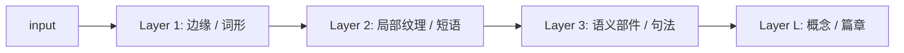

# 设计说明：纯粹性 / Less is More 下的 Attention Residuals

本文件沉淀《Attention Residuals》一文中非公式性的观点与工程判断，作为代码实现的"灵魂文档"。
严格对应文章 §1 – §6，不引入外部主张。

---

## 0. 术语表

| 术语 | 英文 | 含义 |
| --- | --- | --- |
| 层次化特征金字塔 | hierarchical feature pyramid | 浅层学简单模式、深层学抽象概念 |
| 残差 | residual | `F_l(x_l) = x_{l+1} - x_l`，即"还不会的部分" |
| 隐式纵向自注意力 | implicit vertical self-attention | 现有 Transformer 残差网络承载的、不可审计的层间信息流 |
| 显式纵向自注意力 | explicit vertical self-attention | 论文主张：把层间信息流显式参数化为注意力 |
| HC / mHC | (modified) Hyper-Connections | 字节 / DeepSeek 的多通道残差连接 |
| Pre-Norm | — | 在残差分支的 F 内部先做 LayerNorm |
| Post-Norm | — | 在 x + F(x) 之外再做 LayerNorm |
| Attn Residual | — | `AttnRes_l = Σ_k a_{l,k} x_k`，`Σ_k a_{l,k}=1` |
| Full Attention Residuals | — | 高层对所有底层有直通路径 |
| Block Attention Residuals | — | 分段策略：Block 内部经典残差，Block 间 Attn Residual |

---

## §1 深度学习为何要更深

核心假设：多层非线性变换的堆叠会自动产生层次化特征表示。浅层学简单模式，深层抽象复杂概念。
"更深"不是目的本身，而是获得"更精准、更稳定、更可靠"的手段。

加深引入新问题：梯度消失、优化困难；这正是残差网络及其后续演进要回答的核心命题。

---

## §2 残差诞生：让加深具备可能性

关键洞察：与其让每层直接学"输入 → 目标"的完整映射，不如让它只学输入与目标之间的**残差**
`F_l(x_l)`，然后叠加回去：

$$
x_{l+1} = x_l + F_l(x_l)
$$

三点好处：
1. 每层只需关注"还不会的部分"，优化目标更简单；
2. 梯度通过短路连接直达浅层，缓解梯度消失；
3. 若某层学不到有用信息，可退化为恒等映射，保证不退化。

类比：像人类学习中的"错题本"——基础部分由浅层掌握，深层只修补偏差。

> 残差网络的最大贡献，是把"深层网络训练"从概率事件变成了确定性事件。

---

## §3 迁移挑战：从 CNN 到 Transformer（Pre-Norm vs Post-Norm）

残差从 CNN 迁移到 Transformer 后，问题在"100 层+"的尺度上仍然暴露：

- **信息稀释的不可控性**：早层信息通过加法隐式传递，可能被后续层噪声逐渐淹没；
- **耦合过紧的不可预测**：横向自注意力与纵向信息流纠缠，训练动态难以分析。

工程侧的两种常见折中：
- **Post-Norm**：`LN(x + F(x))`。直观，但浅层信息的绝对尺度逐层丢失，深层要重复学习。
- **Pre-Norm**：`x + F(LN(x))`。残差本身不归一化，但输入下一层前再归一化，会让深层难以区分"归一化偏差"与"微小学习目标"。

因此面对百层规模，需要更精细、更显式的信息流动机制。

---

## §4 演进探索：HC / mHC 的局限

HC / mHC（字节、DeepSeek）把单通道残差扩展为多通道 + 可混合，类比"分科学习"。
公式（简化）：

$$
X^{(m)}_{l+1} = \sum_n A_{m,n} X^{(n)}_l + F_l\!\left(\sum_n B_{m,n} X^{(n)}_l\right)
$$

局限有二：
1. **没有跨层的混合**：历史学习成果被视作不可分割的整体，所有历史都成为每一步的沉重负担（信息过载）；
2. **复杂度带来新的不确定性**：特殊初始化、繁琐超参、可复现性下降。

> **这提示我们：修补式微创新，可能并非通往高确定性的终极路径。**

HC/mHC 作为"分类学习"的思路在工程中仍然有价值（见 PR-6-03），但它无法替代"分层学习"。

---

## §5 回归本质：Attention Residuals 设计

### 5.1 核心公式

把纵向信息传递显式化为一个可学习的自注意力：

$$
\text{AttnRes}_l(x_0, \ldots, x_l) = \sum_{k=0}^{l} a_{l,k}\, x_k,\quad
\sum_{k=0}^{l} a_{l,k} = 1,\quad
a_{l,k} = \text{softmax}_k\!\left(\frac{q_l \cdot K_k}{\sqrt{d}}\right).
$$

新的残差公式：

$$
x_{l+1} = \text{AttnRes}_l(x_{\le l}) + F_l(x_l).
$$

每一层只新增一个 Query 矩阵 `W_Q^{(l)}`；Key 可取自历史 hidden 或共享 `W_K`。这使"每一层都主动挑选它需要的历史"。

### 5.2 三项确定性保障

1. **必然关注**：`Σ_k a_{l,k} = 1` 保证信息守恒，浅层有效信息得到最大保真；
2. **纵横解耦**：横向 MHA 做上下文；纵向 AttnRes 做层间残差；两者的 `W_Q` 独立；
3. **分段机制**：Block Attention Residuals 把 L 层切成 G 段，纵向注意力只跨 Block 出口计算；复杂度从 `O(L²)` 降到 `O((L/B)² + L)`。

### 5.3 纯粹性 / Less is More

- 默认单头、无 dropout、softmax 不加温度；
- Query 矩阵是唯一新增的必需参数；
- 接口尽量保持与 `nn.Module` 的最小兼容；
- 任何"增强"（多头、dropout、温度）都作为可选开关暴露，不进入默认路径。

### §5 末段的工程取舍："2 选 1"

文章作者观察到：在 Block Attention Residuals 图中同时保留"黑色线（Block 内经典残差）"与"红色线（Block 间 Attn Residual）"会造成信息冗余；数学上虽然也能收敛，但设计不纯粹。
**本工程采用的默认策略：Block 间使用 Attn Residual，Block 内部也使用 Attn Residual（或可切换到经典残差），但不同时保留二者。** 对应 PR-5-02。

---

## §6 开放讨论

1. **多头纵向自注意力**：把 `W_Q / W_K / W_V` 做头划分，保留"Query 是主要新增参数"的纯粹性（PR-6-01）。
2. **动态跳层**：给每一层引入可学习的 sigmoid 门控 `g_l`，推理期低于阈值的层直接短路（PR-6-02）。
3. **多通道分层**：把 HC 的分类思路与 AttnRes 的分层思路合并（PR-6-03）。

---

## 设计原则速览

- **先有结构、再有参数**：新增参数只在有物理意义的地方引入（Query）；
- **硬约束**：纵向权重必须 softmax 归一化，`Σ a_{l,k} = 1` 不可以变成损失正则项；
- **可审计**：每一层对外暴露 `a_{l,k}` 权重；
- **可替换**：所有连接策略（Classic / HC / mHC / AttnRes / Block AttnRes / Multi-Head AttnRes）都通过同一个 `ResidualStack` 接口切换；
- **纯粹优先**：默认路径最小、最清晰，任何增强都作为可选开关。
