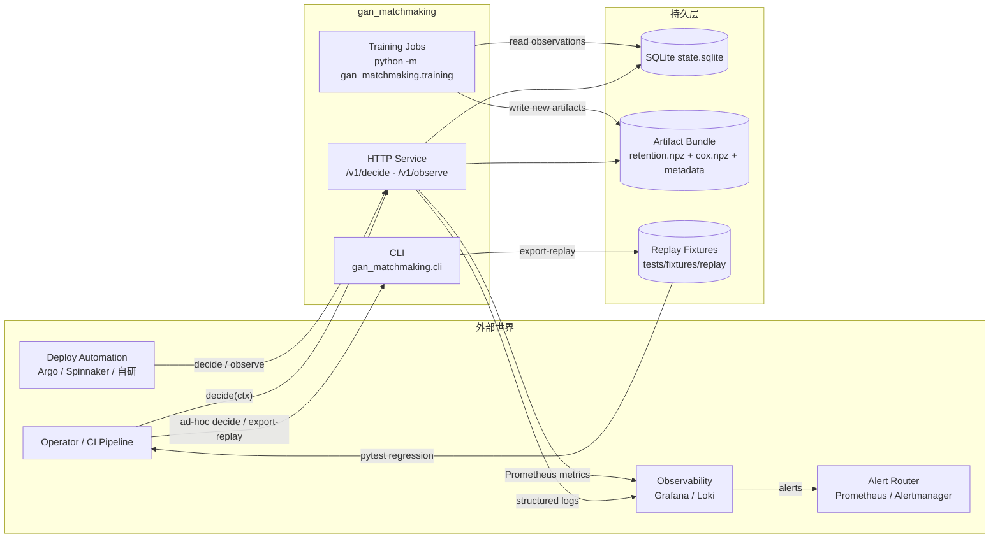
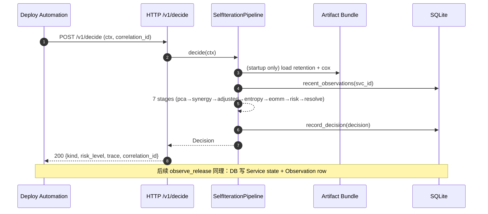
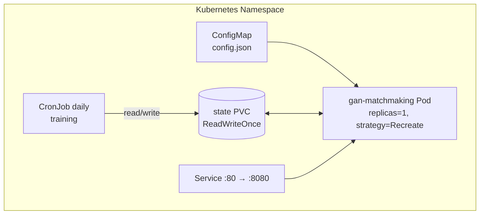

# 01 · System Context

本系统不是独立产品，而是嵌在发布 / 变更流水线里的一个决策服务。本文定义：
**谁会调我们、我们会调谁、数据怎么流、边界在哪里**。

## 1. C4 级别 · System Context



## 2. 调用方视角

### 2.1 Deploy Automation（主调用方）

- **调用时机**：每次发布前、canary 分步推进前、回滚判定前
- **协议**：HTTP `POST /v1/decide` + JSON body
- **期望响应时间**：p99 < 50ms（实测 1.7ms，47× 余量）
- **期望行为**：
  - 拿到 `Decision.kind` 直接驱动 Deploy 动作
  - 拿到 `Decision.correlation_id` 写入发布日志，便于回溯
  - 读 `X-Correlation-Id` 响应头与请求头对齐
- **错误契约**：
  - 400 `gan.http.bad_request` → 自身 payload 问题，立即失败
  - 422 `gan.*` typed error → 业务校验失败（服务不存在、budget 为 0 等）
  - 503 `/readyz` not ready → 切备份决策器或人工介入
  - 500 `gan.http.unhandled` → 立刻告警，禁止重试

### 2.2 Operator / CI（次调用方）

- **主要动作**：
  - `python -m gan_matchmaking.cli decide --input ...` 本地决策 dry-run
  - `python -m gan_matchmaking.cli export-replay ...` 事后导出回归 fixture
- **场景**：事故复盘、PR review、策略调整前的影响评估
- **边界**：CLI 不是 production surface，**不要**把 CI 的决策流量导到 CLI

### 2.3 Alert Router / Observability（单向下游）

- 读 `/metrics` 拿 Prometheus 指标
- 读 stderr JSONL 日志（fluent-bit / loki 直吃）
- 关键告警见 [`07-observability-contract.md`](07-observability-contract.md)

## 3. 被调用方视角

### 3.1 State Store（SQLite，今天）

- **契约**：`persistence/base.py` 里三份 Repository 协议
- **写入者**：**单一进程**（由 lease 保证，见 06）
- **读取者**：pipeline 启动时 hydrate、training job、CLI export-replay
- **演进**：未来换 PostgreSQL 时接口不动，见 ADR-0007

### 3.2 Artifact Bundle

- **目录结构**（由 `ArtifactsConfig` 的 filename 字段控制）：
  ```
  training_artifacts/
  ├── retention_weights.npz
  ├── retention_artifact.json   # metadata
  ├── cox_beta.npz
  └── cox_artifact.json         # metadata
  ```
- **生命周期**：见 [`05-artifact-lifecycle.md`](05-artifact-lifecycle.md)
- **版本识别**：`ArtifactMetadata.version` 由 SHA-256 payload 哈希稳定生成
- **校验**：pipeline 启动时做三重校验（name / shape / feature_names），
  不通过降级为 bootstrap 并写 trace

## 4. 数据流（粗粒度）



## 5. 边界声明（不做的事）

这些 **不是** 本系统的职责，避免被加需求：

- ❌ 不做 CI / CD 编排（我们只回答"能不能发")
- ❌ 不做告警定义（我们只发 metric，不定义 SLO threshold）
- ❌ 不做特性开关（feature flag 是 caller 的事）
- ❌ 不做模型 serving 的高吞吐场景（p99 < 50ms 是决策式，不是查询式）
- ❌ 不做跨集群一致性（FileLease 不是分布式锁，见 ADR-0007）
- ❌ 不做多租户隔离（一个 pipeline 实例 = 一个组织 / 一个产品线）

## 6. 部署形态（默认）



多副本部署是**单独的架构方向**，不是默认路径。要上多副本必须走
ADR-0007 的升级路径：分布式 lease + 外部数据库。

## 7. 下一篇

读 [`02-decision-flow.md`](02-decision-flow.md)，了解 `decide(ctx)` 内部的
7 个 stage 如何组合成一次决策。
