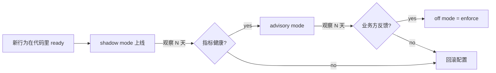

# 08 · Rollout & Governance

本系统自己就是一个"发布决策器"，但它自身怎么被发布、怎么演进，
需要另一套治理机制。本文定义：

1. **行为变更** 如何从 shadow 走到 enforce
2. **架构变更** 如何从 ADR 走到代码
3. **契约变更** 如何不破坏下游

## 1. 行为变更的三档推进

当 pipeline 的**决策策略**或**参数**发生变化（比如新的 Cox 模型、调整的风险
阈值、新的 resolve_decision 规则），必须按以下顺序推进：



### 1.1 Shadow 阶段（0~14 天）

- **配置**: `shadow_mode=shadow`
- **行为**: 新策略计算出来，但 `/v1/decide` 返回永远被改写为 HOLD
- **观察指标**:
  - `gan_shadow_diff_total{suppressed_kind=...}` — 本来会下发什么
  - 对比同期线上实际决策分布
  - stage 失败率、延迟分布
- **退出条件**: 4 条全部成立：
  1. 无 `stage.*.degraded` 突增
  2. `suppressed_kind` 分布与预期 QPS / ratio 吻合
  3. 延迟 p99 仍在 SLO 内
  4. 审计日志有足够样本（通常 ≥ 1000 条）

### 1.2 Advisory 阶段（14~28 天）

- **配置**: `shadow_mode=advisory`
- **行为**: 新决策原样返回给 caller，但 rationale 里带 `shadow_mode=advisory`
- **约定**: Deploy Automation **不应该** 自动执行 advisory 决策，仅记录
- **观察**: 业务方反馈、"跟随 advisory 做"的事后统计
- **退出条件**: 至少一次人工 review 认可

### 1.3 Enforce 阶段

- **配置**: `shadow_mode=off`
- **行为**: 决策生效，对 caller 透明
- **回退机制**: 发现问题立即切回 `advisory` 或 `shadow`；配置通过 ConfigMap
  可以热更（下次 pod 启动生效）

## 2. 架构变更治理

### 2.1 何时开 ADR

| 场景 | 要 ADR? | 备注 |
|---|---|---|
| 新增 feature 字段（比如 trace 新字段） | 否 | 直接加；更新 `03-trace-schema.md` |
| 修改现有 feature 字段语义 | **是** | 契约变更 |
| 新增模块（比如 `sre/replay.py`） | 否 | 更新 `module-contracts.md` |
| 删除公开 API | **是** | 破坏性 |
| 改变失败处理策略（比如 fallback → fail） | **是** | 默认行为变化 |
| 新的依赖（引入 Redis / etcd） | **是** | 部署复杂度变化 |
| 参数调优（调阈值） | 否 | 走 runbook `tune-risk-thresholds.md` |
| Fix a bug | 否 | 除非修法改变契约 |

### 2.2 ADR 模板

```markdown
# ADR-00NN · <title>

Status: Proposed | Accepted | Deprecated | Superseded by ADR-00MM
Date: YYYY-MM-DD

## Context
为什么现在要做这个决定？当前的问题是什么？

## Decision
具体决定是什么？

## Consequences
- 正面：
- 负面：
- 未覆盖的风险：

## Alternatives considered
看过哪些选项，为什么选了这个？
```

### 2.3 ADR 与代码的链接

- ADR 文件名 `adr/00NN-<short-title>.md`
- 代码 / 文档里引用用 `ADR-00NN` 格式
- `adr/README.md` 维护索引 + 状态
- 一个 ADR 被另一个取代时标 `Superseded by ADR-00MM`，不删除

## 3. 契约变更（下游兼容）

### 3.1 公开契约 inventory

| 契约 | 消费者 | 破坏性变更需要 |
|---|---|---|
| HTTP `/v1/decide` 请求 / 响应 schema | Deploy Automation | ADR + 迁移期 + 下游通告 |
| `Decision.trace` 结构 | Replay corpus、on-call 查询 | 只加不删（见 §3.2） |
| `ReleaseContext.from_dict` 输入 | CLI、HTTP、tests | ADR + 迁移 |
| Artifact file format | 训练 job、运行时 hydrate | ADR + 双版本并存期 |
| SQLite schema | 训练 job、运维 dbg | 必须走 migration |
| 日志事件名 | alert 路由 | 只加不删（保留 6 个月） |
| Metric 名称 + label | Grafana / Prometheus rule | 只加不删（保留 6 个月） |

### 3.2 Trace / Log / Metric 的向后兼容细则

**加字段**: 随时可以。
**删字段**: 先 deprecate 6 个月，期间字段仍出现但可能是占位值。6 个月后才删。
**改类型**: 走 ADR。
**改语义（同类型同名）**: 必须走 ADR + 破坏性迁移通告。

### 3.3 契约破坏的检测

- Trace: `test_replay_corpus.py` 参数化所有 fixture
- Metric: 建议加 `test_metrics_catalog_locked` — snapshot metric 名 + label 集合
- Log: 目前靠 code review；未来可以加 snapshot 测试
- HTTP: `test_http_service.py` 应该覆盖所有 endpoint 的 schema

## 4. 发布节奏

### 4.1 代码发布

- **主线**: `master` 始终保持可部署
- **分支**: feature / fix 分支从 `master` 开出，merge 前 CI 必须绿
- **CI 门禁** (`.github/workflows/ci.yml`):
  - Python 3.10 / 3.11 / 3.12 矩阵
  - 全量 pytest
  - Benchmark gate (`python -m bench.latency --quick --p99-ms=50`)
- **版本号**: `pyproject.toml::version`。大版本靠 ADR 决定

### 4.2 Artifact 发布

- **训练**: 每日 CronJob
- **部署**: 下次 pod 重启时 hydrate 新 artifact
- **回滚**: rsync 旧目录 + restart pod（见 `05-artifact-lifecycle.md#7.3`）

### 4.3 Config 发布

- **热更友好**: 通过 ConfigMap mount，pod 重启生效（不是热加载）
- **破坏性变更**: 走 shadow → advisory → enforce

## 5. Review 标准

### 5.1 每个 PR 合入前必须：

- [ ] 影响的契约已更新（trace schema / metric catalog / log catalog / ADR）
- [ ] 新加的行为有对应的测试
- [ ] 破坏性变更有迁移方案
- [ ] `pytest -q` 全绿
- [ ] Benchmark 未回归（`python -m bench.latency --quick`）
- [ ] 如果动了 shadow/advisory 相关逻辑，验证 `F-002` 不复发

### 5.2 每个 PR 的文档责任

- 动了架构 → 更新 `docs/architecture/`
- 动了 API → 更新 HTTP / CLI 文档
- 动了状态 → 更新 `state-lifecycle.md` 和 `04-state-and-failure-domains.md`
- 引入新依赖 → 更新 `pyproject.toml` + CI
- 新增 runbook 场景 → 写 runbook

## 6. 事故响应与 postmortem

详见 `docs/runbooks/`。关键原则：

1. **对每个 SEV-2+ 事故，必须写 postmortem**
2. **事故引入的 fix 必须配 replay fixture**（防止再度发生）
3. **ADR 只记录决策，postmortem 记录教训**，两者独立归档

## 7. 演进路线（当前规划）

F-001 ~ F-010 已 resolved；历史 tracker 只保留审计背景。当前可执行路线以
`claude-review/spec-v3/` 和 `implementation-roadmap.md` 为准：

- **短期**: 继续补 replay artifact metadata-shape / advisory-mode 场景
- **中期**: 评估分布式 lease backend（仅当部署目标需要多 writable replica）
- **长期**: calibration、artifact storage policy、OpenTelemetry trace 对齐

每一条都在路线图里，不是凭空想出来的待办。

## 8. 参考

- ADR 目录：[`../adr/`](../adr/)
- Runbook 目录：[`../runbooks/`](../runbooks/)
- Review 目录：[`../claude-review/`](../claude-review/)
- Implementation roadmap：[`../implementation-roadmap.md`](../implementation-roadmap.md)
