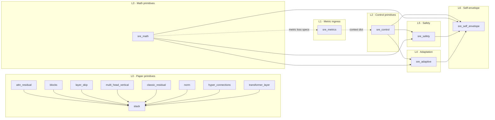

# Detailed Architecture · Rounds 7–9 (as of 2026-05-12)

> **Purpose**: This document is the mechanical reference for the attention-residuals package
> after codex's Round 7–9 work landed. It complements [`docs/ARCHITECTURE.md`](../ARCHITECTURE.md)
> by going one level deeper: data-flow per-tick, API contracts per class,
> and the exact invariant-enforcement sequences.
>
> Read [`docs/ARCHITECTURE.md`](../ARCHITECTURE.md) first for the high-level view.
> Read this document when you need to change code without breaking invariants.

## Quick navigation

| 你想做的事 | 跳到这里 |
| --- | --- |
| 了解 7 层架构 | [§1 Seven-layer architecture](#1-seven-layer-architecture) |
| 看模块之间怎么串 | [§2 Module dependency graph](#2-module-dependency-graph) |
| 跟一条 tick 的数据流 | [§3 Per-tick data flow](#3-per-tick-data-flow-canonical-control-plane-path) |
| 查某个类的 API 契约 | [§4 API contracts per class](#4-api-contracts-per-class-post-r9-signatures) |
| 改代码前查 invariant 是怎么守的 | [§5 Invariant enforcement sequences](#5-invariant-enforcement-sequences) |
| 学怎么组合模块到生产管线 | [§6 Composition patterns](#6-composition-patterns-how-modules-plug-together) |
| 加新原语时的约定 | [§7 Extension points](#7-extension-points-for-codexs-future-work) |
| 确认当前已知限制 | [§8 Known limitations](#8-known-limitations-as-of-round-9) |
| 跑验证命令 | [§9 Diagnostic commands](#9-diagnostic-commands) |
| 估算下一轮工作量 | [§10 Change budget](#10-change-budget) |

---

## 1. Seven-layer architecture

```
┌─────────────────────────────────────────────────────────────────────┐
│  L7 · Operator Controls                                             │
│        env.relax() / registry.register() / alert acknowledgement   │
├─────────────────────────────────────────────────────────────────────┤
│  L6 · Self-Learning Envelope          sre_self_envelope.py         │
│        LearnedSafetyEnvelope · ContractionAwareEnvelope            │
│        EnvelopeLearner · CreditAwareLabeler                        │
├─────────────────────────────────────────────────────────────────────┤
│  L5 · Industrial Safety Layer          sre_safety.py                │
│        SafetyEnvelope · ShadowRunner                                │
│        CounterfactualExplainer · WeightDriftDetector               │
├─────────────────────────────────────────────────────────────────────┤
│  L4 · Closed-Loop Adaptation           sre_adaptive.py              │
│        HedgeRegretLearner · AdaptiveCombiner                        │
├─────────────────────────────────────────────────────────────────────┤
│  L3 · Math Primitives & Observers      sre_math.py                  │
│        ScaleInvariantNormalizer · TemperatureScheduler              │
│        MultiViewCombiner · FTRLLearner                              │
│        JacobianContractionMonitor · TemporalCreditAssigner          │
│        WassersteinDriftDetector                                      │
│        MetricLossSpec/Mapper · AuditCreditReplay                    │
│        AuditReplayCursor · StreamingAuditCreditReplay               │
├─────────────────────────────────────────────────────────────────────┤
│  L2 · Control Primitives               sre_control.py               │
│        WeightedConvexCombiner · AuditTrail                          │
│        MustAttendRegistry · DecoupledControlLoop                    │
│        HierarchicalBlockController · BudgetGate                     │
├─────────────────────────────────────────────────────────────────────┤
│  L1 · Metric Ingress                   sre_metrics.py               │
│        PrometheusHTTPClient · PrometheusContextReader               │
│        OpenTelemetryJSONMetricReader                                │
├─────────────────────────────────────────────────────────────────────┤
│  L0 · Paper Primitives                 attn_residual.py · blocks.py │
│        transformer_layer.py · stack.py · norm.py                    │
│        classic_residual.py · hyper_connections.py                   │
│        layer_skip.py · multi_head_vertical.py                       │
└─────────────────────────────────────────────────────────────────────┘
```

**Key property**: each layer only *constrains* the layer below. L7 can call `relax()` to loosen
L6; L6 can tighten what L5 applies; L5 clips actions proposed by L4; L4 tilts `bias` but cannot
breach hard invariants inside L2. L1 and L3 feed observable signals upward. **No layer reaches
up and mutates a higher layer's state directly.**

---

## 2. Module dependency graph



**Red lines (critical invariants crossing modules)**:

- `WeightedConvexCombiner` in L2 is used by `MultiViewCombiner` in L3 (each view owns one). That
  composition preserves `Σa=1` per view.
- `TemporalCreditAssigner` in L3 is consumed by `CreditAwareLabeler` in L6. Blame scores influence
  envelope tightening.
- `JacobianContractionMonitor` in L3 is consumed by `ContractionAwareEnvelope` in L6 as a
  `gain_provider` callable. Plant-gain estimate modulates `max_delta`.
- `AuditCreditReplay` in L3 reads `AuditTrail` JSONL from L2. Offline replay reconstructs
  L3 state without needing L2 to re-run.

---

## 3. Per-tick data flow (canonical control-plane path)

```
┌── raw metrics ─────────────────────────────────────────────────────────┐
│  Prometheus / OTel / custom exporter                                   │
└──────────────────┬─────────────────────────────────────────────────────┘
                   ▼ HTTP / JSON
┌─────────────────────────────────────────────────────────────────────────┐
│  L1 · PrometheusContextReader.read_context()                            │
│       → Dict[str, float]  e.g. {"p99_ms": 120, "queue_depth": 1500}     │
└──────────────────┬──────────────────────────────────────────────────────┘
                   ▼ context
┌─────────────────────────────────────────────────────────────────────────┐
│  L3 · ScaleInvariantNormalizer.observe_and_transform()                  │
│       → z-scored signal array                                           │
└──────────────────┬──────────────────────────────────────────────────────┘
                   ▼ query + values
┌─────────────────────────────────────────────────────────────────────────┐
│  L4 · AdaptiveCombiner.step(query, values, observed_losses)             │
│       → raw_action, weights                                             │
│       Invariants: Σ weights = 1, floor ≤ w ≤ ceiling                   │
└──────────────────┬──────────────────────────────────────────────────────┘
                   ▼ raw_action
┌─────────────────────────────────────────────────────────────────────────┐
│  L6 · ContractionAwareEnvelope.apply(raw_action)                        │
│       → uses JacobianContractionMonitor.gain() from L3                  │
│       → scales inner.max_delta temporarily                              │
│       Invariant: inner state not mutated across try/finally             │
└──────────────────┬──────────────────────────────────────────────────────┘
                   ▼ delegates
┌─────────────────────────────────────────────────────────────────────────┐
│  L6 · LearnedSafetyEnvelope.apply(scaled_action)                        │
│       → clipped_action, info dict                                       │
│       Invariants: current_low ≥ hard_low, current_high ≤ hard_high,    │
│                  |delta| ≤ current_max_delta                           │
└──────────────────┬──────────────────────────────────────────────────────┘
                   ▼ clipped_action (actuated)
┌─────────────────────────────────────────────────────────────────────────┐
│  Plant / actuator (Kubernetes / service mesh / traffic router)          │
└──────────────────┬──────────────────────────────────────────────────────┘
                   ▼ next-tick observation
┌─────────────────────────────────────────────────────────────────────────┐
│  L3 · JacobianContractionMonitor.observe(action, state_delta)           │
│       L3 · TemporalCreditAssigner.record(tick, weights, losses)         │
│       L2 · AuditTrail.record(combiner, action, context)                 │
└──────────────────┬──────────────────────────────────────────────────────┘
                   ▼ back-prop feedback
┌─────────────────────────────────────────────────────────────────────────┐
│  L6 · EnvelopeLearner.ingest(action, ctx, delta)                        │
│         → labeler(ctx) = CreditAwareLabeler                             │
│         → queries TemporalCreditAssigner for blame ratio                │
│         → downgrades UNSAFE evidence by (1 - controllable_ratio)         │
│         → envelope.observe(action, evidence, delta)                     │
│         → every fit_every ticks: envelope.fit()                         │
│             Invariants: only tightens, never widens                     │
└─────────────────────────────────────────────────────────────────────────┘
```

**Step-by-step responsibilities**:

| Step | Layer | Module | Responsibility | Output |
| --- | --- | --- | --- | --- |
| 1 | L1 | `PrometheusContextReader` | Pull metrics, reduce per-query | context dict |
| 2 | L3 | `ScaleInvariantNormalizer` | Z-score online EWMA | normalized array |
| 3 | L4 | `AdaptiveCombiner` | Softmax + bias + clip to simplex | raw_action, weights |
| 4 | L6 | `ContractionAwareEnvelope` | Modulate max_delta by plant gain | scaled_action |
| 5 | L6 | `LearnedSafetyEnvelope` | Clip to [low, high] + rate-limit | clipped_action |
| 6 | Plant | (external) | Apply action | next state |
| 7a | L3 | `JacobianContractionMonitor` | Track empirical gain | `gain()` |
| 7b | L3 | `TemporalCreditAssigner` | Record per-tick blame contributions | history entry |
| 7c | L2 | `AuditTrail` | Append decision record | JSONL entry |
| 8 | L6 | `EnvelopeLearner` + `CreditAwareLabeler` | Downgrade UNSAFE by blame ratio | evidence |
| 9 | L6 | `LearnedSafetyEnvelope.observe/fit` | Accumulate evidence, ratchet on quorum | new bounds (if fit fires) |

---

## 4. API contracts per class (post-R9 signatures)

### 4.1 L2 · `sre_control`

#### `SignalSpec`
```python
@dataclass
class SignalSpec:
    name: str
    floor: float = 0.0        # ∈ [0, ceiling]
    ceiling: float = 1.0      # ∈ [floor, 1]
    bias: float = 0.0         # additive logit adjustment; writeable post-hoc
```
**Invariant**: `0 ≤ floor ≤ ceiling ≤ 1` enforced at `__post_init__`.

#### `WeightedConvexCombiner`
```python
class WeightedConvexCombiner:
    def __init__(self, signals: Sequence[SignalSpec], query_dim: int,
                 temperature: float = 1.0, rng_seed: Optional[int] = 0): ...
    def combine(self, query: np.ndarray, values: Sequence[np.ndarray]
                ) -> tuple[np.ndarray, np.ndarray]:
        """Returns (action, weights). Σweights == 1, floor ≤ w ≤ ceiling."""
    def last_weights(self) -> Optional[np.ndarray]: ...
```
**Invariants**:
- `Σ floor_k ≤ 1` checked at `__init__` (else ValueError).
- Output weights satisfy `floor_k ≤ a_k ≤ ceiling_k` and `Σ a_k == 1` to within numerical tolerance.

#### `AuditTrail`
```python
class AuditTrail:
    def record(self, combiner: WeightedConvexCombiner, action: np.ndarray,
               context: Optional[Mapping[str, float]] = None) -> AuditRecord: ...
    def to_jsonl(self) -> str: ...
    def __iter__(self) -> Iterable[AuditRecord]: ...
    def __len__(self) -> int: ...
```
**Invariants**:
- Append-only. `AuditRecord` is a frozen snapshot.
- `combine()` MUST have been called before `record()`, else `RuntimeError`.

### 4.2 L3 · `sre_math`

#### `TemporalCreditAssigner`
```python
class TemporalCreditAssigner:
    def __init__(self, decay: float = 0.9): ...         # 0 < decay ≤ 1
    def record(self, tick: int, weights: np.ndarray, losses: np.ndarray,
               signal_names: Optional[Sequence[str]] = None,
               context: Optional[Dict[str, float]] = None): ...
    def attribute(self, incident_tick: int, window: int = 50,
                  top_k: Optional[int] = None) -> List[CreditEntry]: ...
```
**Known issue** (P1 in action items): `_history` is unbounded.

#### `AuditCreditReplay`
```python
class AuditCreditReplay:
    def __init__(self, credit_assigner: TemporalCreditAssigner,
                 loss_mapper: LossMapper): ...
    def replay_record(self, record: Mapping[str, Any]) -> None: ...
    def replay_records(self, records: Iterable[Mapping]) -> int: ...
    def replay_jsonl(self, text: str) -> int: ...
    def replay_jsonl_file(self, path: str) -> int: ...
```
**Fail-loud contract**: any of (missing signals, wrong shape, negative loss,
non-mapping context, bad JSON) raises `ValueError` with actionable message.

#### `StreamingAuditCreditReplay`
```python
class StreamingAuditCreditReplay:
    def __init__(self, replay: AuditCreditReplay, path: str,
                 *, encoding: str = "utf-8",
                 missing_ok: bool = False,
                 cursor: Optional[AuditReplayCursor] = None): ...
    def poll(self) -> int:
        """Read newly-appended complete JSONL records. Returns replay count."""
```
**State contract**:
- `cursor.offset` only advances when a chunk is parsed without error.
- `cursor.pending` holds at most one partial line.
- `cursor.resets` increments when `os.path.getsize` < `cursor.offset` (truncation).
- On `ValueError`, cursor does NOT advance; next `poll()` re-reads the same bytes.

### 4.3 L4 · `sre_adaptive`

#### `AdaptiveCombiner`
```python
class AdaptiveCombiner:
    def __init__(self, signals: Sequence[SignalSpec], query_dim: int,
                 learner: Optional[HedgeRegretLearner] = None,
                 temperature: float = 1.0, rng_seed: Optional[int] = 0): ...
    def step(self, query: np.ndarray, values: Sequence[np.ndarray],
             observed_losses: Optional[np.ndarray] = None
             ) -> tuple[np.ndarray, np.ndarray]: ...
    def records(self) -> List[AdaptiveRecord]: ...
```
**Composition contract** (fixed in `ba8fad8`):
```
spec.bias_per_tick = static_bias_captured_at_init + learner.logits()
```
Learner cannot erase operator-provided static `bias`.

**Edge cases**:

| Condition | Behavior |
| --- | --- |
| `learner=None` at construction | Internally creates `HedgeRegretLearner(n_signals=len(signals))` with default `eta`. |
| `observed_losses=None` on first call | Skip learner `update()`; still runs combine with current logits. |
| `observed_losses` length ≠ `len(signals)` | `ValueError` raised by the learner. |
| Caller mutates `signals[i].bias` between constructor and `step()` | **Not supported**; the captured `_static_biases` are used. Document as: bias must be final at construction. |
| `signals` list mutated (e.g. appended) at runtime | **Not supported**; combiner's `W_K` matrix is sized to the initial length. |

### 4.4 L5 · `sre_safety`

#### `SafetyEnvelope` (static)
```python
@dataclass
class SafetyEnvelope:
    low: np.ndarray
    high: np.ndarray
    max_delta: Optional[np.ndarray] = None
    def apply(self, action: np.ndarray) -> tuple[np.ndarray, Dict[str, Any]]: ...
    @property
    def violation_count(self) -> int: ...
```

#### `ShadowRunner`
```python
class ShadowRunner:
    def __init__(self, baseline_fn: Callable, shadow_fn: Callable,
                 divergence: str = "l2"): ...
    def tick(self, *args, context: Optional[Dict] = None, **kwargs
             ) -> tuple[np.ndarray, ShadowRecord]:
        """Always returns baseline_fn's action. Shadow is observed only."""
    def summary(self) -> Dict[str, float]: ...
```

### 4.5 L6 · `sre_self_envelope`

#### `OutcomeEvidence`
```python
@dataclass(frozen=True)
class OutcomeEvidence:
    safety_score: float      # ∈ [0, 1], 1 = fully SAFE
    confidence: float = 1.0  # ∈ [0, 1], evidence mass
    reason: str = ""
    @classmethod
    def from_label(cls, label: OutcomeLabel, *, reason="") -> OutcomeEvidence: ...
    @classmethod
    def from_weights(cls, safe_weight: float, unsafe_weight: float,
                     *, reason="") -> OutcomeEvidence: ...
    @property
    def safe_weight(self) -> float: ...      # = safety_score * confidence
    @property
    def unsafe_weight(self) -> float: ...    # = (1 - safety_score) * confidence
    def hard_label(self) -> OutcomeLabel: ...
```
**Dual-evidence semantics**: `OutcomeEvidence(0.3, 1.0)` contributes `0.3` to
SAFE weights and `0.7` to UNSAFE quorum. This is intentional but under-documented
(see P3 action item).

#### `LearnedSafetyEnvelope`
```python
class LearnedSafetyEnvelope:
    def __init__(self, action_dim: int,
                 hard_low: np.ndarray, hard_high: np.ndarray,
                 hard_max_delta: np.ndarray, *,
                 min_max_delta: Optional[np.ndarray] = None,
                 initial_low/high/max_delta: Optional[np.ndarray] = None,
                 safe_quantile: float = 0.95,         # ∈ (0.5, 1.0)
                 hysteresis: float = 0.1,              # ∈ [0, 1]
                 unsafe_quorum: int = 5,               # ≥ 1
                 min_safe_samples: int = 20,           # ≥ 1 — see P1
                 buffer_size: int = 500): ...
    def apply(self, action) -> tuple[np.ndarray, Dict[str, Any]]: ...
    def observe(self, action, outcome: OutcomeLike, *,
                delta=None, step=None): ...
    def fit(self) -> Dict[str, Any]: ...
    def relax(self, *, factor=1.5, to_hard=False,
              dim: Optional[int] = None): ...
    def current_bounds(self) -> Dict[str, np.ndarray]: ...
    def fit_history(self) -> List[Dict[str, Any]]: ...
```

#### `CreditAwareLabeler`
```python
class CreditAwareLabeler:
    def __init__(self, base_labeler: Labeler,
                 credit_assigner: TemporalCreditAssigner,
                 controllable_signals: Sequence[str], *,
                 incident_tick_key: str = "tick",
                 window: int = 50,
                 top_k: Optional[int] = None,
                 min_total_score: float = 1e-12): ...
    def __call__(self, context: Dict[str, Any]) -> OutcomeEvidence: ...
    def last_adjustment(self) -> Dict[str, float]: ...
```

**Adjustment formula**:
```
ratio = controllable_credit / total_credit           # clipped to [0, 1]
adjusted.unsafe_weight = original.unsafe_weight * ratio
```

---

## 5. Invariant enforcement sequences

These are the exact call paths that enforce each critical invariant. Changing
code in these paths requires preserving the sequence.

### 5.1 I-1 · Hard bounds never breached by automatic code

**Enforced at**: `LearnedSafetyEnvelope.fit()` lines ~400–425.

**Sequence**:
```python
# 1. Compute proposed bounds from SAFE samples + hysteresis.
proposed_hi = q_hi + pad
proposed_lo = q_lo - pad

# 2. Ratchet: only tighten.
new_high = np.minimum(self.current_high, proposed_hi)
new_low  = np.maximum(self.current_low,  proposed_lo)

# 3. Clip to hard bounds.
new_high = np.maximum(new_high, self.hard_low)      # can't go below hard_low
new_high = np.minimum(new_high, self.hard_high)     # can't exceed hard_high
new_low  = np.minimum(new_low,  self.hard_high)
new_low  = np.maximum(new_low,  self.hard_low)

# 4. Non-degeneracy.
new_high = np.maximum(new_high, new_low + 1e-9)
```
**Regression test**: `test_learned_bounds_never_exceed_hard_bounds_after_fit`.

### 5.2 I-2 · `relax()` is the only widening path

**Enforced at**: source-code audit. Grep-check:
```
grep -nE "self\.current_(low|high|max_delta)\s*=" attention_residuals/sre_self_envelope.py
```
Only locations are:
- `__init__` (initial set)
- `fit()` (after ratchet — can only narrow)
- `relax()` (operator-driven widening)

**Regression test**: `test_multiple_fits_never_widen_bounds`.

### 5.3 I-3 · Σa=1 in `WeightedConvexCombiner`

**Enforced at**: `_project_to_simplex_with_bounds` in `sre_control.py`.

**Sequence**:
```python
for _ in range(max_iter):
    x = np.minimum(np.maximum(x, floors), ceilings)    # clip
    residual = 1.0 - x.sum()
    if abs(residual) < tol: return x
    if residual > 0:
        room = ceilings - x                           # only unsaturated
        x += residual * room / room.sum()
    else:
        room = x - floors                             # only above floor
        x -= (-residual) * room / room.sum()
```
**Regression test**: `test_combiner_weights_sum_to_one` + `test_combiner_respects_floor` + `test_combiner_respects_ceiling`.

### 5.4 I-4 · Inner state not mutated across `ContractionAwareEnvelope.apply`

**Enforced at**: `sre_self_envelope.py` `ContractionAwareEnvelope.apply`.
```python
saved_md = self.inner.current_max_delta.copy()          # snapshot
self.inner.current_max_delta = np.maximum(saved_md * scale, self.inner.min_max_delta)
try:
    clipped, info = self.inner.apply(action)
finally:
    self.inner.current_max_delta = saved_md              # restore
```
**Regression test**: `test_contraction_wrapper_does_not_mutate_inner_state`.
**Known weakness** (P2): not thread-safe. Two concurrent `apply` calls can
overlap. See action items.

### 5.5 I-5 · Credit-aware downgrade is multiplicative, never divisive

**Enforced at**: `CreditAwareLabeler.__call__` in `sre_self_envelope.py`.
```python
ratio = max(0.0, min(1.0, controllable_credit / total_credit))
adjusted = OutcomeEvidence.from_weights(
    evidence.safe_weight,                  # SAFE never amplified
    evidence.unsafe_weight * ratio,        # UNSAFE only reduced
    reason=f"credit_adjusted:{ratio:.3f}",
)
```
**Regression test**: none yet specifically on this (added P3 note).

---

## 6. Composition patterns (how modules plug together)

### 6.1 Minimal control-plane wiring

Use case: existing service already has metrics; just want audit + safe action.
```python
from attention_residuals import (
    SignalSpec, WeightedConvexCombiner, AuditTrail, SafetyEnvelope,
)

combiner = WeightedConvexCombiner([
    SignalSpec("p99_breach"),
    SignalSpec("queue_depth"),
    SignalSpec("error_budget", floor=0.25),
], query_dim=3)

envelope = SafetyEnvelope(
    low=np.array([-2.0]), high=np.array([+3.0]),
    max_delta=np.array([1.0]),
)
trail = AuditTrail()

# Per-tick:
action, weights = combiner.combine(query, values)
clipped, info = envelope.apply(action)
trail.record(combiner, clipped, context={"qps": 1000})
# apply clipped to actuator
```
**5 lines per tick. No learning. Fully auditable.**

### 6.2 Closed-loop with bias learning

```python
from attention_residuals import (
    SignalSpec, AdaptiveCombiner, SafetyEnvelope, HedgeRegretLearner,
)

learner = HedgeRegretLearner(n_signals=3, eta=0.3)
combiner = AdaptiveCombiner([SignalSpec("a"), SignalSpec("b"), SignalSpec("c")],
                            query_dim=3, learner=learner)
envelope = SafetyEnvelope(low=..., high=..., max_delta=...)

for t in ticks:
    action, weights = combiner.step(query_t, values_t, observed_losses=prev_losses)
    clipped, _ = envelope.apply(action)
    # apply clipped; observe next-tick losses
    prev_losses = ...
```

### 6.3 Full closed-loop with self-envelope + credit routing

```python
from attention_residuals import (
    SignalSpec, AdaptiveCombiner, HedgeRegretLearner,
    LearnedSafetyEnvelope, ContractionAwareEnvelope,
    EnvelopeLearner, CreditAwareLabeler, OutcomeEvidence,
    TemporalCreditAssigner, JacobianContractionMonitor,
    AuditTrail, AuditCreditReplay, MetricLossSpec, MetricLossMapper,
)

# Learning stack
learner = HedgeRegretLearner(n_signals=3, eta=0.3)
combiner = AdaptiveCombiner(signals, query_dim=3, learner=learner)

# Observability stack
tca = TemporalCreditAssigner(decay=0.9)
monitor = JacobianContractionMonitor(window=64)
trail = AuditTrail()

# Safety stack
env = LearnedSafetyEnvelope(action_dim=1, hard_low=..., hard_high=..., hard_max_delta=...)
wrapper = ContractionAwareEnvelope(env, gain_provider=monitor.gain, target_gain=1.0)

# Labeler
def base_labeler(ctx): return OutcomeEvidence(...)
labeler = CreditAwareLabeler(base_labeler, tca, controllable_signals={"controller"})

# Orchestrator
env_learner = EnvelopeLearner(wrapper, labeler=labeler, fit_every=25)

# Per-tick
prev_losses = None
for t in ticks:
    # AdaptiveCombiner.step consumes prev_losses and internally calls learner.update().
    # Do NOT call learner.update() yourself.
    action, weights = combiner.step(query_t, values_t, observed_losses=prev_losses)
    clipped, info = wrapper.apply(action)
    # apply clipped to actuator; observe state_delta and compute this-tick losses
    state_delta_t = apply_to_plant(clipped)
    monitor.observe(action=clipped[0], state_delta=state_delta_t, step=t)
    tca.record(t, weights=weights, losses=prev_losses if prev_losses is not None else np.zeros(3),
               signal_names=[...])
    trail.record(combiner.combiner, clipped, context={"tick": t, ...})
    env_learner.ingest(clipped, context={"tick": t, "slo_breach": ...}, delta=delta_t)
    prev_losses = compute_per_signal_losses(...)  # feed back into next tick's combiner.step
```

This is the target production wiring. ~20 lines per tick, and everything is
auditable end-to-end.

**Wire-up note**: The only place `learner.update()` runs is **inside** `AdaptiveCombiner.step`
when you pass `observed_losses`. If you call `learner.update()` yourself you will
double-count the loss and the regret bound no longer holds.

### 6.4 Offline post-mortem from audit JSONL

```python
from attention_residuals import (
    TemporalCreditAssigner, MetricLossSpec, MetricLossMapper, AuditCreditReplay,
)

tca = TemporalCreditAssigner(decay=0.9)
specs = {
    "p99_breach":  MetricLossSpec("p99_ms", mode="above", threshold=300, scale=0.01),
    "queue_depth": MetricLossSpec("queue_depth", mode="above", threshold=1000, scale=0.001),
    "budget_burn": MetricLossSpec("error_budget_remaining", mode="below", threshold=0.3, scale=2.0),
}
replay = AuditCreditReplay(tca, MetricLossMapper(specs))

replay.replay_jsonl_file("/var/log/sre/audit.jsonl")
top5 = tca.attribute(incident_tick=some_tick, window=100, top_k=5)
for entry in top5:
    print(f"t={entry.tick} signal={entry.signal_name} score={entry.score:.3f}")
```

---

## 7. Extension points (for codex's future work)

When adding a new control primitive, follow the pattern:

1. **Locate the right layer** using the seven-layer diagram.
   - If it takes raw metrics → L1.
   - If it transforms/observes signals without deciding → L3.
   - If it makes a per-tick decision with `Σ=1` → L2 or L4.
   - If it clips actions or provides safety checks → L5.
   - If it reads feedback from audit and updates its own structure → L6.

2. **Pick the right base class**.
   - Mimic `WeightedConvexCombiner`'s constructor shape for deciders.
   - Mimic `SafetyEnvelope`'s `apply(action) → (clipped, info)` signature for safety modules.
   - Mimic `TemporalCreditAssigner`'s `record / attribute` pair for observers.

3. **Preserve invariants**.
   - If your class holds state that is a distribution, ensure `Σ == 1` on return.
   - If your class holds state that is a bound, ensure monotone ratchet OR document widen-path.
   - If your class wraps another, snapshot/restore in try/finally.

4. **Export injection points for tests**.
   - HTTP / file I/O → injectable callable.
   - RNG → `rng_seed` parameter or `np.random.Generator`.
   - Time → pass `step` or `ts` rather than calling `time.time()`.

5. **Add in the following order**:
   1. Type definitions and invariants in docstring
   2. Implementation
   3. Deterministic tests (mock time, mock RNG, mock I/O)
   4. One demo script under `examples/`
   5. One markdown doc under `docs/`
   6. Update `__init__.py` and `__all__`
   7. Add entry to `knowledge-base.html`

---

## 8. Known limitations (as of Round 9)

| Limitation | Impact | Workaround | Addressed in |
| --- | --- | --- | --- |
| `TemporalCreditAssigner._history` unbounded | Memory / latency grow linearly with time | Manually rotate history or periodic restart | P1 action |
| `min_safe_samples` semantic confusion w/ soft labels | Operators set count-like threshold but it's evidence-like | Set `min_safe_samples` ÷ mean confidence | P1 action |
| `ContractionAwareEnvelope.apply` not thread-safe | Concurrent calls may corrupt inner state | Serialize calls (GIL suffices in pure Python) | P2 action |
| Streaming replay blocks on bad JSON | Stalled pipeline needs manual intervention | Sanitize upstream; restart replay | P2 action |
| Lazy `nn.ModuleList` in `share_key=False` | DDP rank desync on first forward | Pre-populate keys before wrapping | P3 doc note |
| No HTTP / persistent store | Library-only, not a runtime service | Host inside any Python service | Out of scope |
| No cross-service envelope federation | Each service learns independently | Share `hard_bounds` via config | Out of scope |
| No RL-based policy gradient | No end-to-end bandit optimization | Hand-tune `eta` and `bias` | Out of scope |

---

## 9. Diagnostic commands

From repo root:

```bash
# Full test suite
pytest -q
# expected: 154 passed

# Collect-only (count and verify no import errors)
pytest --collect-only -q
# expected: "154 tests collected"

# Full demo sweep (all four new ones)
python -m examples.demo_credit_aware_envelope
python -m examples.demo_audit_credit_replay
python -m examples.demo_metric_source_replay
python -m examples.demo_streaming_audit_replay

# HTML sanity (sections & SVG balance)
python -c "from pathlib import Path; t=Path('docs/knowledge-base.html').read_text(encoding='utf-8'); \
  print('sections:', t.count('<section '), '/', t.count('</section>')); \
  print('svg:', t.count('<svg'), '/', t.count('</svg>'))"

# Diagnostics (IDE-driven, should show zero)
# In Kiro: getDiagnostics on sre_*.py files
```

---

## 10. Change budget

For codex's next round, target:

- **P1 items** (AI-1 + AI-2): ~140 LoC of code changes + ~5 new tests. No public API breakage.
- **P2 items** (AI-3 + AI-4): ~70 LoC + ~4 new tests.
- **P3 items** (AI-5 + AI-6 + AI-7): ~40 LoC code + ~30 LoC docs + 1 test.
- **Total**: ~250 LoC + ~10–15 new tests across 7 items. One commit per P1, batch P2/P3 if safe.

Aim to keep the test count growing at ~5–8 per P1 so coverage discipline persists.
