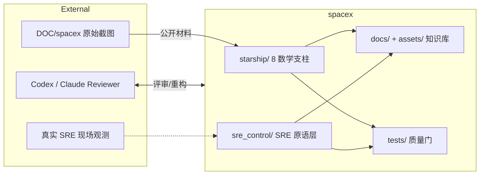
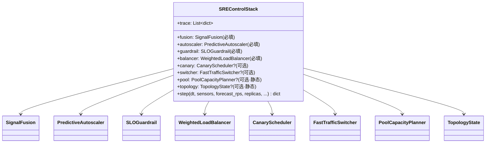
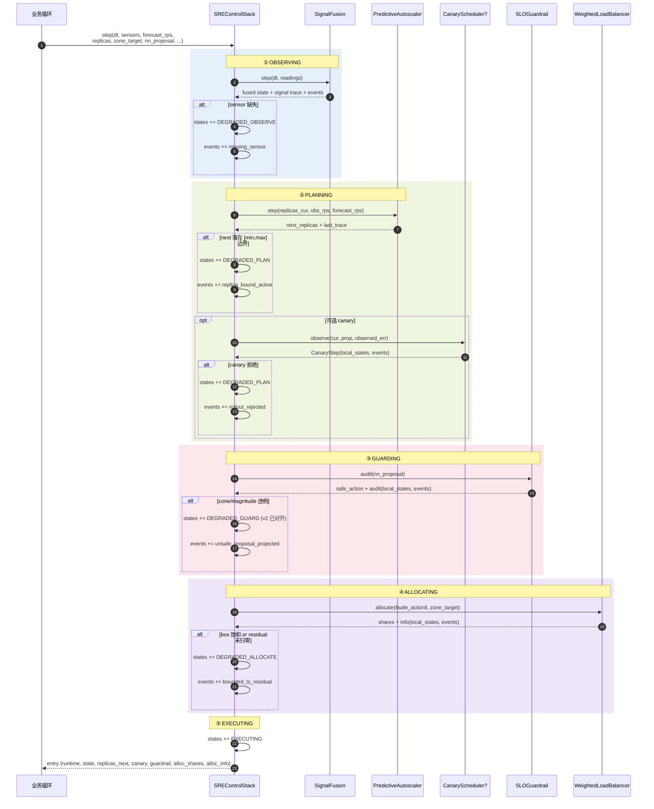
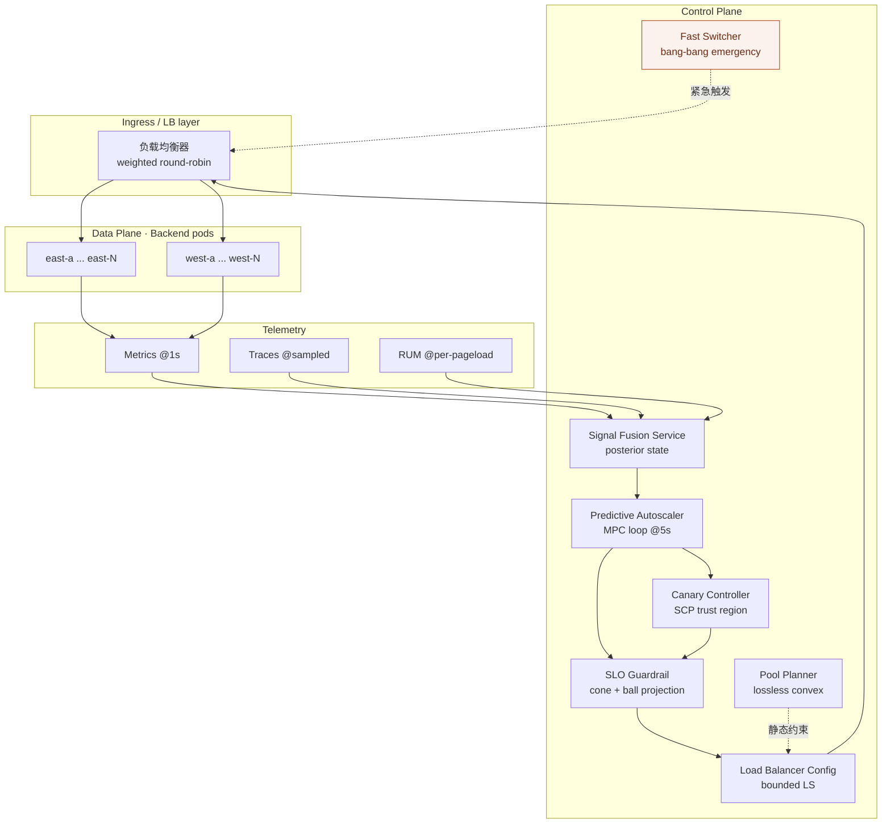

# Detailed Architecture · Historical Architecture Note

> Historical architecture leaf from the 2026-05-12 Claude package; it is not the current handoff.
> Opus review should start from `docs/opus-review/HANDOFF.md`, then verify
> live status in `wiki/review-backlog.md`,
> `docs/codex-review/OPEN_RISKS.md`, and
> `docs/codex-review/QUALITY_GATES.md`.

> 用 C4 风格的 5 层视图 + 运行时图 + 降级图，把 `spacex/` 的架构讲透。本文档专门为
> **Codex 下一轮 session** 写，目的是让 Codex 在开始改动前就对整条链路的边界、数据
> 流和失效传播有一致的心智模型。

## 1. Context View — 这个工程在更大的世界里是什么



**边界声明**：
- **源材料** (`DOC/spacex/`)：只读，工程绝不修改原件。
- **星舰物理层** (`starship/`)：只讲物理学 + 数学，**不**认识 SRE 术语。
- **SRE 迁移层** (`sre_control/`)：把星舰原语翻译成 SRE 词汇，**单向**依赖星舰。
- **知识与证据层** (`docs/` + `analysis/`)：只读前两层的产物再加工，不反向影响。

---

## 2. Container View — 几个大盒子之间的关系

```mermaid
flowchart TB
  subgraph L0[源材料层]
    DOC[DOC/spacex/ OCR截图]
  end

  subgraph L1[数学实现层 · starship/]
    LC[lossless_convex.py §1]
    SC[scp.py §2]
    RB[rigid_body.py §3]
    TC[thrust_constraints.py §4]
    EK[ekf.py §5]
    MP[mpc.py §6]
    FM[flip_maneuver.py §7]
    CC[catch_controller.py §8]
    QT[quaternion.py 工具]
    TY[types.py 共享类型]
    PL[pipeline.py 端到端]
  end

  subgraph L2[SRE 迁移层 · sre_control/]
    PP[pool_planner.py]
    CS[canary_scheduler.py]
    TS[topology_state.py]
    SL[slo_guardrail.py]
    SF[signal_fusion.py]
    PA[predictive_autoscaler.py]
    FS[fast_switcher.py]
    WL[weighted_balancer.py]
    ST[stack.py 装配]
    EV[events.py 共享 schema]
  end

  subgraph L3[证据层 · analysis/]
    A1[s01..s08 单主题 before/after]
    A9[s09_sre_stack.py 端到端]
    AR[artifacts/ PNG + SUMMARY.txt]
  end

  subgraph L4[知识层 · docs/]
    KB[knowledge-base.html]
    AC[API_CONTRACTS.md]
    RS[RUNTIME_STATES.md]
    ES[EVENT_SCHEMA.md]
    AR2[ARCHITECTURE.md]
    CH[CODEX_HANDOFF.md]
    CR[claude-review/]
  end

  subgraph L5[执行层 · tests/ + examples/ + scripts/]
    TT[tests/*.py]
    EX[examples/demo_*.py]
    SK[scripts/build_kb.py]
  end

  DOC -.->|逐张识别 + 翻译| LC
  DOC -.-> SC
  DOC -.-> RB

  LC --> PP
  SC --> CS
  RB --> TS
  QT --> TS
  TC --> SL
  EK --> SF
  MP --> PA
  FM --> FS
  CC -.->|参考几何| WL
  TY --> PP

  EV --> PP
  EV --> CS
  EV --> TS
  EV --> SL
  EV --> SF
  EV --> PA
  EV --> FS
  EV --> WL

  PP --> ST
  CS --> ST
  TS --> ST
  SL --> ST
  SF --> ST
  PA --> ST
  FS --> ST
  WL --> ST

  LC --> A1
  SC --> A1
  RB --> A1
  TC --> A1
  EK --> A1
  MP --> A1
  FM --> A1
  CC --> A1
  ST --> A9
  A1 --> AR
  A9 --> AR

  L1 --> KB
  L2 --> KB
  AR --> KB
  AC --> KB
  RS --> KB
  ES --> KB

  L1 --> TT
  L2 --> TT
  L2 --> EX
  SK --> AR

  CR -.->|评审反馈| L2
```



**关键 invariant**：
- 虚线都是"只读依赖"（`analysis` 读 `starship`，`docs` 读前面所有），实线是 import。
- 从 `sre_control` 有且只有 **两条** import 星舰：`starship.mpc`（被 `predictive_autoscaler` 用）和 `starship.ekf`（被 `signal_fusion` 用），另外 `topology_state` 用 `starship.quaternion`，`slo_guardrail` 用 `starship.thrust_constraints`。没有反向依赖。
- `sre_control/events.py` 是**本层内部**共享的 schema，所有其他 `sre_control/*.py` import 它。**`starship/*.py` 不得 import `events.py`**。

---

## 3. Component View — 每个盒子里长什么样

### 3.1 sre_control 的统一 adapter 模板

每个 adapter 都长成同样的形状：

```
┌─────────────────────────────────────────────┐
│  PublicAdapter (dataclass)                 │
│                                             │
│  fields: policy knobs (thresholds, limits) │
│  state : optional persistent state         │
│                                             │
│  def step/allocate/audit/...(input) -> dict:
│      local_states = [initial_fsm_state]   │
│      events = []                          │
│      ...核心计算...                       │
│      if <degradation_condition>:          │
│          local_states.append(<degraded>)  │
│          events.append(make_event(...))   │
│      return {                             │
│          "result fields": ...,            │
│          "local_states": local_states,    │
│          "events": events,                │
│      }                                    │
└─────────────────────────────────────────────┘
```

**为什么统一**：让 `SREControlStack.step()` 只需要做同一件事：收集所有 adapter 的
`local_states` / `events` 到栈级 trace 里，无须为每个 adapter 写特判。

### 3.2 SREControlStack 的装配逻辑



**必填 4 件**决定闭环最小集：观测(fusion) → 规划(autoscaler) → 安全(guardrail) → 执行(balancer)。

**可选 4 件**按需插入：canary 做灰度、switcher 做紧急切换、pool 做静态容量规划、topology 做拓扑一致性。

### 3.3 events.py 的 schema 边界

```
┌──────────────────────────────────────────────────┐
│ events.py (迁移层内部 schema)                   │
│                                                  │
│ REQUIRED_EVENT_FIELDS = ("stage","kind",        │
│                          "detail","safe_action") │
│                                                  │
│ EVENT_COUNTEREXAMPLES = {                        │
│   "missing_sensor": "Do not ...",               │
│   "rollout_rejected": "Do not ...",             │
│   "unsafe_proposal_projected": ...,             │
│   "replica_bound_active": ...,                  │
│   "deadline_exceeded": ...,                     │
│   "bounded_ls_residual": ...,                   │
│   "pool_capacity_clipped": ...,                 │
│   "topology_state_repaired": ...,               │
│ }                                                │
│                                                  │
│ def make_event(stage, kind, detail, safe_action):
│     if kind not in EVENT_COUNTEREXAMPLES:       │
│         raise ValueError   ← 新增 kind 必须同步 │
│                                                  │
│ def validate_event(event):                      │
│     所有字段都是非空 string                     │
│     kind 在 counterexample 表里                 │
└──────────────────────────────────────────────────┘
```

**约定**：新增 event kind 时必须按顺序做 3 件事：
1. 加 `EVENT_COUNTEREXAMPLES` 条目
2. 加产生该 kind 的真实代码路径
3. 补 `tests/test_event_schema.py` 的生成测试

---

## 4. Runtime View — 一个 tick 里到底发生了什么

`SREControlStack.step(dt, ...)` 在一个 tick 内的完整时序：



**阶段边界不可穿透的原则**：

- **OBSERVING 失败 → 降级 PLANNING**（不跳过 PLANNING）。理由：prediction 可以基于降级后的 posterior 继续运行。
- **PLANNING 失败 → 继续 GUARDING**（不跳过）。理由：即便规划弱，guardrail 仍要把任何下游动作投回可行集。
- **GUARDING 不可跳过**。理由：任何 tick 都必须过 cone/ball。
- **ALLOCATING 必须执行**。理由：哪怕满 residual，也要给出"尽力而为"的分配，不要空返回。

---

## 5. Deployment View — 真正跑的时候是什么样

虽然本工程是研究性质的仿真包，但它已经映射到了一套**可迁移的部署形态**：



**部署侧 invariants**：
- Telemetry 永远流向控制面，从不反过来。
- LB 只接受来自 guardrail 的已审批配置，不直接吃 plan/canary 的输出。
- `switch` 是 break-glass 路径，正常拓扑中不启用；触发时绕过 canary/balancer。

---

## 6. 依赖方向护栏（请 Codex 在下一轮保持）

```
allowed   : starship/*   ← no imports from sre_control/
allowed   : sre_control/* ← may import starship/*
allowed   : sre_control/events.py ← no imports from starship/
disallowed: starship/*    ← cannot import sre_control/events
disallowed: analysis/*    ← cannot import sre_control (analysis 可 import 但仅为了示例)
disallowed: docs/*        ← no runtime code at all
```

**为什么**：
- 星舰层被迁移层污染后，任何 SRE 语义的改名（如 "guardrail" 改成 "gatekeeper"）都会传染到物理层。
- `events.py` 是迁移层内部契约。如果星舰层 import 它，以后把星舰换成生产级 GNC 代码时会被事件 schema 绑死。

**如何验证**（建议 Codex 在下一轮加 `tests/test_import_graph.py`）：

```python
import ast, pathlib

def imports_of(path):
    tree = ast.parse(path.read_text(encoding="utf-8"))
    return [n for n in ast.walk(tree)
            if isinstance(n, (ast.Import, ast.ImportFrom))]

def test_starship_does_not_import_sre_control():
    for p in pathlib.Path("starship").rglob("*.py"):
        for node in imports_of(p):
            mods = ([a.name for a in node.names]
                    if isinstance(node, ast.Import)
                    else [node.module or ""])
            for m in mods:
                assert not m.startswith("sre_control"), \
                    f"{p} illegally imports {m}"
```

---

## 7. 性能预算（用 20 Hz 量纲校准）

| 阶段 | 目标预算 (ms) | 当前观测 |
|---|---|---|
| SignalFusion.step | 0.2 | <0.5 (含 `numpy` 开销) |
| PredictiveAutoscaler.step | 2.0 | ~1.8 (L-BFGS-B 15 步 horizon) |
| SLOGuardrail.audit | 0.05 | <0.05 (闭式投影) |
| WeightedLoadBalancer.allocate | 1.0 | ~0.8 (`scipy.lsq_linear`, N=4) |
| Stack.step 总和 | 5.0 | ~3.5 |

**复利含义**：20 Hz (50 ms) 控制周期下总预算 50 ms，现在只吃了 ~7%，**有 ≥10× 冗余**用于：
- 加入更高维观测
- 扩大 MPC horizon
- 用 CVXPY + OSQP 替换 SLSQP（未来生产需要更好精度时）

---

## 8. 演化蓝图（下一轮候选）

按依赖方向"由下往上"逐步加厚：

1. **已完成**：`starship/stability_monitor.py`（§2.1 Lyapunov dV/dt≤0 监视器）和 SRE wrapper `StabilityGuard`。
2. **已完成**：`events.py` 使用 `adapter_exception` 映射 recoverable adapter 异常，`stability_violation` 只映射 Lyapunov 红线。
3. **已完成**：`analysis/s10_failure_trace.py` 用 `runtime.events` 做 before/after 对比，展示事件密度和共现热力图。
4. **下一步**：给 `sre_control/topology_state.py` 加 `distance_to(target)` 的方向性（当前是对称 L2，考虑加带方向约束的场景）。
5. **下一步**：把 s10 的 JSONL 从 sample 扩展为全量 trace，并补 dashboard 查询示例。

每一步都是**单原子 commit**，不跨层。

---

## 附录 A：本文档的信息源

本架构文档的内容来自：

- `sre_control/*.py`（代码层）
- `sre_control/events.py`（事件 schema 定义）
- `docs/API_CONTRACTS.md`（Codex 写的契约文档）
- `docs/RUNTIME_STATES.md`（Codex 写的运行态 FSM 文档）
- `docs/EVENT_SCHEMA.md`（Codex 写的事件指南）
- `analysis/s09_sre_stack.py`（端到端行为证据）
- 我对上述文件的审查过程（见 `REVIEW_OF_CODEX_SESSION.md`）

Historical note: this file was the architecture source for the earlier Claude package.
For current Opus review authority, use `docs/opus-review/HANDOFF.md` and the live ledgers above before editing architecture docs.
