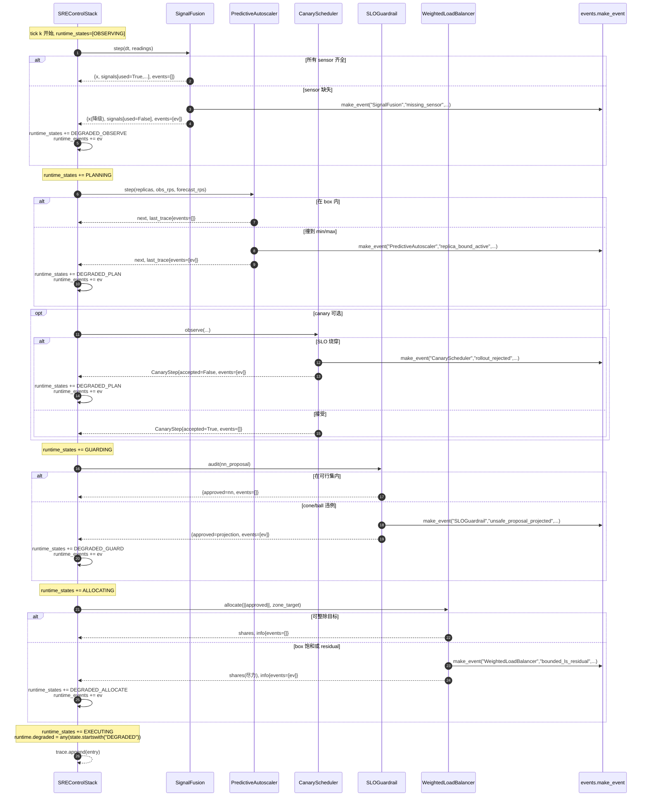

# Event Lifecycle · Historical Event Lifecycle Note

> Historical event-lifecycle leaf from the 2026-05-12 Claude package; it is not the current handoff.
> Opus review should start from `docs/opus-review/HANDOFF.md`, then verify
> live status in `wiki/review-backlog.md`,
> `docs/codex-review/OPEN_RISKS.md`, and
> `docs/codex-review/QUALITY_GATES.md`.

> 配合 `sre_control/events.py` + `SREControlStack.step()` 一起看。本文档用**逐帧追踪**
> 的形式展示"一个 tick 如何产生事件"以及"3 种典型场景下事件密度随时间的演化"。

## 1. 事件的生命周期（单条）

每个 runtime event 都走完全相同的 5 步：

```
   [adapter 内部]                 [adapter 返回]           [stack 汇总]              [trace 留存]            [下游消费]
   ─────────────                   ─────────────             ───────────               ─────────               ─────────
   检测到 degradation  ─→  make_event(stage, kind, ...)  ─→  本地 events 列表
                                │                             │
                                │                             ↓
                                │                     stack.runtime_events
                                │                     stack.runtime_states  += "DEGRADED_*"
                                │                             │
                                │                             ↓
                                │                     entry["runtime"] 写入 trace
                                │                             │
                                │                             ↓
                                │                     被 analysis / incident review / dashboard 读
                                │
                                └──→ validate_event() 在测试时检验 schema
```

**关键原则**：
1. **adapter 只负责检测 + 命名**。事件命名空间由 `EVENT_COUNTEREXAMPLES` 的 key 集合封闭。
2. **stack 只负责汇总**。不解释事件含义，不做副作用（不重试、不降级、不告警）。
3. **下游才做 policy**。是要 alert on-call、还是写 incident log、还是喂给 ML-based RCA，都由 stack 外部决定。

这种分层让"加一个新事件 kind"和"加一个新消费者"可以正交演化。

---

## 2. 单 tick 时序（对应 `DETAILED_ARCHITECTURE.md §4`）



---

## 3. 三种典型场景的逐帧追踪

下面三个场景在 `analysis/s09_sre_stack.py` 里都能真实跑出来。读者可以对着 `SUMMARY.txt`
和本文档交叉验证。

### 3.1 场景 A · 常态（t=0..60s）

**预期事件密度**：接近 0。只有冷启动阶段偶发 `replica_bound_active`（副本数在 min 起步）。

```
tick 0     tick 1     tick 2     ...    tick 11
─────      ─────      ─────            ─────
[OBS]     [OBS]      [OBS]            [OBS]
[PLAN]    [PLAN]     [PLAN]    ...    [PLAN]
[GUARD]   [GUARD]    [GUARD]          [GUARD]
[ALLOC]   [ALLOC]    [ALLOC]          [ALLOC]
[EXEC]    [EXEC]     [EXEC]           [EXEC]

events:  []  ← degraded=False 全程
```

**健康指征**：
- `runtime.degraded = False` 持续
- `runtime.events = []` 或仅冷启动几拍含 `replica_bound_active`
- `signals[*].used = True` 全部为真

### 3.2 场景 B · Brown-out（t=60..80s）

**物理含义**：观测链路之一（trace 通道）开始间歇性失联；latency 抖动但 RPS 没变化。

**预期事件密度**：阶段性 burst，`missing_sensor` 每几 tick 一次；`unsafe_proposal_projected` 跟着升高（因为上游策略基于不完整观测给出过激建议）。

```
scenario timeline:
──────────────────────────────────────────────────────────
t=60s  trace channel 开始间歇缺失
t=62s  fusion 累计 3 次 missing_sensor → posterior drift
t=64s  autoscaler 基于漂移观测提出激进扩容
t=65s  guardrail 投影掉越界 proposal → unsafe_proposal_projected
t=70s  canary 检测 SLO 抖动 → 2 次 rollout_rejected
t=80s  trace channel 恢复；events 归零
──────────────────────────────────────────────────────────

per-tick event counts (approximate):
  tick 12 (t=60s) : [ms]                       ← missing_sensor × 1
  tick 13 (t=65s) : [ms, up]                   ← + unsafe_proposal_projected
  tick 14 (t=70s) : [ms, up, rr]               ← + rollout_rejected
  tick 15 (t=75s) : [ms, up]
  tick 16 (t=80s) : []                         ← 恢复
```

**健康指征**：
- `runtime.degraded = True` 持续，直到 trace 恢复
- 多个 adapter 同时出现 event（不是单 adapter 的孤立失效）
- 事件收敛时刻滞后 observation 恢复 1-2 tick（posterior 需要重新收敛）

**读 `runtime.events` 的方法**：看 `kind` 多样性 + 时间窗聚集。如果同一 `kind` 在 ≥3
连续 tick 出现，说明不是 transient，需要根因分析。

### 3.3 场景 C · Surge（t=180..200s）

**物理含义**：RPS 翻倍，但观测链路完整。

**预期事件密度**：`replica_bound_active` 主导；如果 max_capacity 够大且 horizon 够长，
事件应该在几 tick 内消失（MPC 成功扩容跟上）。

```
scenario timeline:
──────────────────────────────────────────────────────────
t=180s  RPS 跳 1200 → 2400
t=180s  autoscaler 一次性扩 replicas_max=50  (max_step=8)
t=180s  打到上限 → replica_bound_active
t=183s  capacity 追齐, replicas 稳定在 28
t=185s  balancer 开始 bounded_ls_residual（zone target 紧）
t=200s  RPS 回落, events 归零
──────────────────────────────────────────────────────────

per-tick event counts:
  tick 36 (t=180s): [rb]             ← replica_bound_active
  tick 37 (t=185s): [rb, br]         ← + bounded_ls_residual
  tick 38 (t=190s): [br]             ← bound 不再活跃
  tick 39 (t=195s): [br]
  tick 40 (t=200s): []
```

**健康指征**：
- `DEGRADED_PLAN` 在前 1-2 拍出现，随后消失
- `DEGRADED_ALLOCATE` 可能在 surge 全程存在（zone 目标与总量的冲突）
- `missing_sensor` 保持为 0（观测没坏）

---

## 4. 事件共现模式（可以用来做异常分类）

| 共现模式 | 可能根因 | 推荐动作 |
|---|---|---|
| `missing_sensor` 连续 ≥ 5 tick | 观测链路故障 | 检查 Prometheus/trace pipeline，不要当成业务事故 |
| `unsafe_proposal_projected` + `replica_bound_active` | 上游策略与容量预估不匹配 | 检查 forecast 模型与真实 RPS 的 bias |
| `rollout_rejected` 单独出现 | 新版本带 regression | 冻结灰度、启 incident |
| `bounded_ls_residual` 单独持续 | zone 目标永远无法满足（geometry 设计问题） | 检查 zone_vector 与 instance 布局是否一致 |
| `topology_state_repaired` 偶发 | 输入数据污染 | 检查上游拓扑信息源 |
| `pool_capacity_clipped` + `replica_bound_active` | 容量配额全局不足 | 申请扩 quota，不是 autoscaler 的锅 |
| `deadline_exceeded` | 紧急切换 rate_max 调得太保守 | 评审 rate cap 是否与 incident SLA 匹配 |

---

## 5. 事件 → dashboard 的最小示例

建议 Codex 下一轮实现时，把 `runtime.events` 写成 JSONL 并用以下查询做 dashboard：

```python
# pseudo — 给 Codex 下一轮参考
import pandas as pd, json
events = []
for line in open("trace.jsonl"):
    entry = json.loads(line)
    for ev in entry["runtime"]["events"]:
        events.append({"t": entry.get("t", 0), **ev})
df = pd.DataFrame(events)

# 每分钟每 kind 的事件密度
density = df.groupby([df["t"]//60, "kind"]).size().unstack(fill_value=0)

# 共现热图
co_occurrence = df.groupby("t")["kind"].apply(set)
# ... do jaccard similarity across ticks
```

这套视图可以把抽象的 "degraded=True" 变成具体的"这段时间到底哪些环节在叫"。
