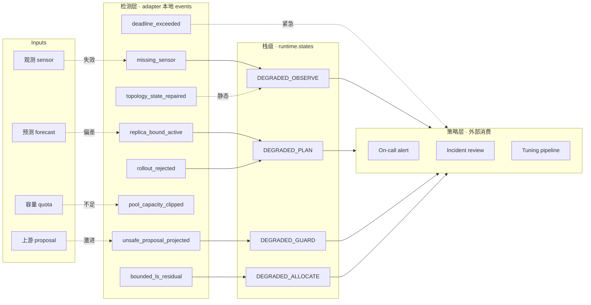

# Failure Modes & Recovery

> 本文档从"会怎么坏"的角度重写架构视角。每个模块有三件东西：**症状（如何检测）、
> 根因（为什么坏）、降级（坏了怎么办）**。

## 失效传播矩阵（概览）



---

## 模块逐个拆解

### §1 · PoolCapacityPlanner

| 症状 | 根因 | 降级路径 | 恢复条件 |
|---|---|---|---|
| `capacity_shortfall_rps > 0`、`pool_capacity_clipped` 事件 | 预测的峰值 RPS 超出 `max_capacity * rps_per_conn` | 池计划 clip 到 `max_capacity`，shortfall 写入 `info["capacity_shortfall_rps"]` 供上游看到 | 申请扩 quota、改 forecast 模型，或接受短时蜗退 |
| `violations_after > 0` | baseline 下界设置错（通常是开发者误给了 `min_keep_alive > max_capacity`） | 返回 violation 计数，不静默 | 修配置 |

**不应该做的事**：不要因为 `capacity_shortfall_rps` 大就自动把 `max_capacity` 往上调。那会
把 quota 决策交给 planner 做，违反关注点分离。

### §2 · CanaryScheduler

| 症状 | 根因 | 降级路径 | 恢复条件 |
|---|---|---|---|
| `rollout_rejected` 事件 + `accepted=False` | 观测错误率超 SLO 预算 | trust region 缩小到一半，不推进 share | SLO 回到预算内连续 N tick |
| trust region 震荡（expand→shrink 反复） | `b_est` 线性斜率估计发散 | 需要外部 reset | 缩短观测窗口、重启 scheduler |
| `rho` 接近 0 / inf 时跳变 | `predicted_gain` 接近 0（模型已经预测到 SLO 极限） | 当前代码走 `rho=1.0` 分支，静默接受 | 需要重审阈值 |

**边界坑**：`rho = 1.0` 的默认值会让灰度在 `predicted_gain ≈ 0` 时仍然推进。如果真实环境
经常贴着 SLO 工作，建议改成 `rho = 0.0`（保守），让 scheduler 停下来等人决策。

### §3 · TopologyState

| 症状 | 根因 | 降级路径 | 恢复条件 |
|---|---|---|---|
| `topology_state_repaired` 事件，输入 quaternion 模长不在 `[1-1e-6, 1+1e-6]` | 上游供给脏数据，或积分数值误差累积 | renormalize 到 1 再做 exp-map；零模特殊处理为 identity | 上游修复或每 N tick 主动归一化 |
| `q_norm` 持续 `> 1 + 1e-5` | `integrate_quaternion` 的 dt 过大 | 考虑每 tick 后显式归一化 | 减小 dt 或在 `step` 末尾 normalize |

**注意**：`TopologyState.step()` 现在会在每次返回前再次跑 `integrate_quaternion`，它内部
已经归一化。所以 `q_norm` 在实际运行中非常稳定（测试里 1000 次步进误差 < 1e-8）。

### §4 · SLOGuardrail

| 症状 | 根因 | 降级路径 | 恢复条件 |
|---|---|---|---|
| `unsafe_proposal_projected` 事件 | `nn_proposal` 越出 cone 或 ball | 返回 projection；`projection_distance` 可度量越界幅度 | 上游策略收敛回 nominal 方向 |
| `cone_margin_after < -1e-3` | 数值精度问题（很少发生） | 应当调查，建议加断言 | — |

**注意**：guardrail 是**最后一道硬护栏**，绝不能跳过。任何尝试"快路径"绕开 guardrail 的 PR
都应该被拒绝。

### §5 · SignalFusion

| 症状 | 根因 | 降级路径 | 恢复条件 |
|---|---|---|---|
| `missing_sensor` 事件 + `signals[i].used=False` | 一个 sensor 本 tick 没数据 | predict 仍执行；仅 skip 该 sensor 的 update | 下 tick sensor 回归 |
| `P_trace` 单调上升 | 多个 sensor 同时失效，posterior uncertainty 放大 | 需要外部判断是否可信 | 足够多 sensor 恢复 |
| `outlier_rejected` 事件 / `signals[i].gated=True` | 观测模型 `h(x)` 与真实偏差大，或 `R` 设置过小 | 跳过该次 update，保护 posterior prediction | 修正 `h(x)` / `R`，或为该 sensor 调整 gate 阈值 |

**注意**：`innovation_gating` 已接入 `SignalFusion.gate_threshold`。不要靠无限调高 gate
来让 `outlier_rejected` 消失；持续 outlier 通常说明观测模型或噪声矩阵本身错了。

### §6 · PredictiveAutoscaler

| 症状 | 根因 | 降级路径 | 恢复条件 |
|---|---|---|---|
| `replica_bound_active` 事件 | `next_replicas` 打到 `replicas_min` 或 `replicas_max` | 返回 clamped 整数，`last_trace` 记录 `raw_next_replicas` | 负载回落或扩 max_cap |
| MPC 解时间 > dt | QP 规模太大 | 当前不 fallback，会拖慢 tick | 下轮应加 timeout → 返回上拍解 |
| forecast 与真实 RPS 系统偏差 | forecast 模型失效 | autoscaler 持续 over/under-provision | 外部监控 `forecast_err` |

**注意**：当前 MPC 使用 `L-BFGS-B`，在 horizon=12 下稳定 <2ms。如果把 horizon 扩到 30
以上，要评估切 `OSQP`/`PROXQP` 的成本收益。

### §7 · FastTrafficSwitcher

| 症状 | 根因 | 降级路径 | 恢复条件 |
|---|---|---|---|
| `deadline_exceeded` 事件 | `T_min > deadline_s`，rate cap 太保守 | 返回完整 plan + event，由调用方决策 | 提高 `rate_max` 或放宽 deadline |
| `peak_rate_per_s` 超出实际 LB 能承受的 config reload 速率 | 理论 rate_max 和物理 rate 不匹配 | **当前未检测**，是风险 | 下轮加 `effective_rate_max` 校验 |

**注意**：bang-bang 的最大价值是"最短时间 + 零终端速度"，但它对模型参数漂移高度敏感。
生产环境强烈建议叠一层 PD 外环做 robustness。

### §8 · WeightedLoadBalancer

| 症状 | 根因 | 降级路径 | 恢复条件 |
|---|---|---|---|
| `bounded_ls_residual` 事件 + `rps_residual > 1e-6` | 需求超过所有实例容量之和 | shares 按 box 饱和，residual 曝出 | 扩容或降低 demand |
| `zone_residual` 非零 | zone target 与 geometry 不匹配（例如 60/40 东西，但所有实例都在东区） | 返回最小二乘解 | 修复 zone_vector 配置 |
| `cost > 0` 且长期不降 | `lsq_linear` 在秩亏下震荡 | 建议加显式 `method="bvls"` 或 `trf` 选择 | — |

**注意**：`saturation` 是 Python bool 列表（本轮修复）。JSON 序列化无歧义，但如果未来改 ndarray 输出，要 guard `numpy.bool_`。

---

## 栈级失效传播的三个典型链路

### 链路 1 · 观测链失效 → 整栈降级

```
sensor 失联 → SignalFusion: missing_sensor → DEGRADED_OBSERVE
                                         ↓
           autoscaler 基于降级 posterior → 多半触发 replica_bound_active
                                         ↓
                              → DEGRADED_PLAN
                                         ↓
           策略基于降级 plan 出激进建议 → guardrail 投影
                                         ↓
                              → DEGRADED_GUARD
```

**读者启示**：看到 runtime.events 里多 kind 同时出现，**先追第一个时间戳**。单点失效会
沿 observe→plan→guard→allocate 传播。

### 链路 2 · 容量不足 → 本地局部降级

```
forecast 跳 2× → PredictiveAutoscaler: replica_bound_active → DEGRADED_PLAN
                                                           ↓
                                            forecast 满足但 zone 不均衡
                                                           ↓
                           WeightedLoadBalancer: bounded_ls_residual → DEGRADED_ALLOCATE
```

与链路 1 的区别：**observe 健康**（`missing_sensor` 为空）。判断链路类型的第一个特征是
`missing_sensor` 的有无。

### 链路 3 · 上游策略激进 → 只触发 guardrail

```
nn_proposal 越界 → SLOGuardrail: unsafe_proposal_projected → DEGRADED_GUARD
                                                           ↓
                              下游 balancer 收到 safe_action，继续正常工作
```

**读者启示**：只有 `DEGRADED_GUARD` 而没有前后 stages 的降级，通常意味着**上游模型有问题**
而不是运行时失控。应该反向追查 `nn_proposal` 的来源。

---

## 恢复策略的优先级

1. **先恢复观测** — 没有好的 posterior，下游全是在估错的数据上工作。
2. **再恢复约束** — guardrail / pool 的约束正确性决定了系统的安全包络。
3. **最后恢复优化** — autoscaler / canary 的优化质量是"锦上添花"。

换句话说：**当资源有限，优先修 observe 而不是 optimize**。这和星舰回收里"传感器比发动
机精调更重要"是同一道理。

---

## 哨兵测试（建议 Codex 下一轮加）

为了防止降级路径静默退化，建议补以下 sentinel 测试：

```python
# tests/test_sentinels.py (建议)

def test_stack_never_silently_executes_with_missing_observation():
    """sensor 全失联时，stack 必须至少把 runtime.degraded 置 True。"""
    ...

def test_stack_propagates_every_adapter_event_at_least_once():
    """枚举当时的 8 个 kind；当前 registry 已扩展到 11 个 kind。"""
    ...

def test_stack_does_not_drop_events_on_stack_level_errors():
    """即使某个 adapter 抛可恢复异常，stack 也应该捕获并转成 adapter_exception 事件。"""
    ...
```

第三个特别重要——当前 `SREControlStack.step()` 不做 try/except，任何 adapter 异常会直接
抛出，中断控制循环。生产环境需要改成"捕获 → 转成事件 → 继续下一个阶段"。
