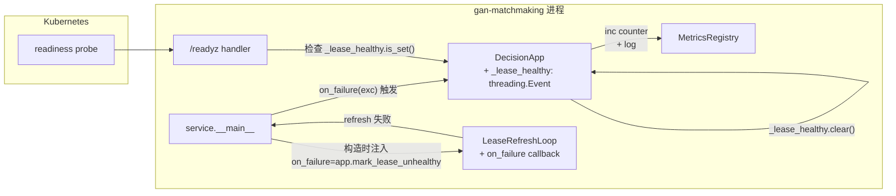
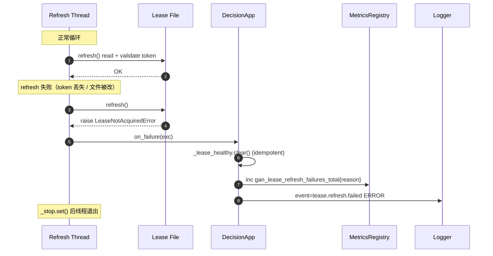
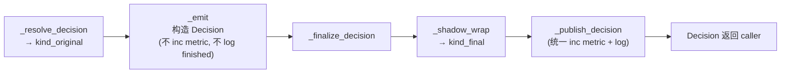
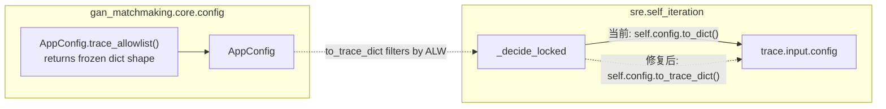

# Design · B+A2 本轮

本文回答 3 个问题：**对象改成什么样？谁调用它？时序如何？**

每条 finding 一节，对齐 [`requirements.md`](requirements.md) 的 R-XXX。

---

## F-001 · Lease refresh 失败可见化

### 设计总览



### 对象变更（精确到字段）

**`gan_matchmaking/sre/leases.py::LeaseRefreshLoop`**

新增字段：
```python
on_failure: Callable[[BaseException], None] | None = None
```

`_run()` 改动：
- **移除** `# pragma: no cover - surfaced by ``error``.` 注释
- **新增** 在捕获异常后调用 `self.on_failure(exc)`（若非空）
- 保留 `self.error = exc` 和 `self._stop.set()` 以向后兼容

**`gan_matchmaking/service/app.py::DecisionApp`**

新增字段：
```python
_lease_healthy: threading.Event = field(default_factory=_event_initially_set, init=False)
m_lease_refresh_failures: Counter = field(init=False)  # 在 __post_init__ 里 register
```
（`_event_initially_set()` 返回一个已 `set()` 的 Event，代表"默认健康"。）

`handle_ready` 改动：
```python
def handle_ready(self, _body):
    if not self._lease_healthy.is_set():
        return 503, {"status": "not_ready",
                     "details": self._lease_unhealthy_details}
    # ... 保留原有 breaker 检查
```

新增方法：
```python
def mark_lease_unhealthy(self, exc: BaseException) -> None:
    """Called by LeaseRefreshLoop when refresh fails.
    Idempotent: 第二次调用不再递增 metric 也不再打日志。
    """
    if not self._lease_healthy.is_set():
        return  # 已经标记，忽略后续
    reason = type(exc).__name__
    self._lease_unhealthy_details = {
        "reason": reason,
        "message": str(exc)[:200],
    }
    self._lease_healthy.clear()
    self.m_lease_refresh_failures.inc(labels={"reason": reason})
    self.pipeline.logger.error(
        "lease.refresh.failed",
        lease_path=self._lease_path or "unknown",
        owner=self._lease_owner or "unknown",
        error_type=reason,
    )
```

**`gan_matchmaking/service/__main__.py`**

构造顺序变更：
```python
app = build_app(config=cfg, store=store)
if args.lease_file:
    lease = FileLease(Path(args.lease_file), owner=args.lease_owner,
                      ttl_seconds=args.lease_ttl_seconds)
    app.bind_lease_metadata(path=args.lease_file, owner=args.lease_owner)
    with LeaseRefreshLoop(lease, on_failure=app.mark_lease_unhealthy):
        run_wsgi(app, host=args.host, port=args.port)
else:
    run_wsgi(app, host=args.host, port=args.port)
```

### 时序（关键路径）



### 不做的事（边界）

- **不主动 shutdown server**：让 k8s readiness probe 把流量切走，pod 自然重启。
  理由：给 inflight request 完成的机会；避免 loop tearing。
- **不做幂等重试**：失败一次就标不健康，不尝试重新获取 lease。重获需要人工或
  next pod 启动时的自然竞争。
- **不放 liveness 检查**：`handle_health` 保持 200，因为进程本身还活着。

---

## F-002 · Shadow rewrite 后监控一致

### 设计总览

现在的问题是 `_emit()` 在 `_shadow_wrap()` **之前**就递增了 metric 和打了日志。
结构性修复 = **把 metric / log 的发出点推迟到 rewrite 之后**。



### 对象变更

**`gan_matchmaking/sre/self_iteration.py::_emit`** (L845~)

去掉其中的：
```python
self.m_decisions.inc(labels={"kind": kind.value, "risk_level": risk_level.value})
self.logger.info("decide.finished", kind=kind.value, ..., chosen_id=...)
```

保留其他（构造 `Decision` 对象、设置 `artifact_version`、`confidence`）。

**`_finalize_decision`** 改动为：

```python
def _finalize_decision(self, decision: Decision) -> Decision:
    original_kind = decision.kind
    decision = self._shadow_wrap(decision)
    self._publish_decision(decision, original_kind=original_kind)
    if self.store is not None:
        self.store.observations.record_decision(decision)
    return decision
```

**新增** `_publish_decision`:

```python
def _publish_decision(self, decision: Decision, *,
                     original_kind: DecisionKind) -> None:
    """Emit metrics/logs once, reflecting the ENFORCED kind."""
    self.m_decisions.inc(labels={
        "kind": decision.kind.value,
        "risk_level": decision.risk_level.value,
    })
    self.logger.info(
        "decide.finished",
        kind=decision.kind.value,
        risk_level=decision.risk_level.value,
        risk_prob=decision.risk_prob,
        confidence=decision.confidence,
        service_id=next(
            (rationale for rationale in decision.rationale if False),
            None
        ) or "",  # service_id 从 decision 元信息拿，见 sketch
        chosen_id=decision.chosen.id if decision.chosen else None,
        artifact_version=decision.artifact_version,
    )
    if original_kind != decision.kind:
        self.logger.info(
            "decide.shadow_rewritten",
            original_kind=original_kind.value,
            final_kind=decision.kind.value,
            correlation_id=decision.correlation_id,
        )
```

> service_id 获取：最简单是让 `_emit` 把 `service.id` 写进 `decision.trace["input"]["context"]["service"]["id"]`（已经在那），`_publish_decision` 从 trace 读。

### 为什么不加 label `enforced_kind`

label 增维会让历史 metric 在 Grafana 上断层。选方案 A（单 label，语义=enforced）
是最小侵入变更。replay corpus 里的旧断言（如果有）仍然能识别 kind。

### 不做的事

- **不改 `gan_shadow_diff_total` 的含义**：它的 label 就是 `suppressed_kind`，
  这次改动不动它。
- **不改 `trace.shadow_mode` / `trace.shadow_suppressed_kind`** 的存在形式：
  `_shadow_wrap` 已经写进 trace，R-104 是回归保护，不是新功能。

### 时序对比

**修复前**：
```
_emit → metric inc (kind=ROLLBACK) → log decide.finished (kind=ROLLBACK)
       → return Decision(kind=ROLLBACK)
_shadow_wrap → Decision.kind = HOLD
persist → SQLite decisions.kind = "hold"
```
→ metric 与 DB 不一致。

**修复后**：
```
_emit → build Decision(kind=ROLLBACK), no metric, no log
_shadow_wrap → Decision.kind = HOLD, diff counter inc(suppressed_kind=rollback)
_publish_decision → metric inc (kind=HOLD), log decide.finished (kind=HOLD),
                    log decide.shadow_rewritten (original=ROLLBACK, final=HOLD)
persist → SQLite decisions.kind = "hold"
```

---

## F-003 · Trace 配置 allowlist

### 设计总览



### 对象变更

**`gan_matchmaking/core/config.py`**

新增类方法 `AppConfig.trace_allowlist() -> dict`，显式列出允许的字段：

```python
_TRACE_ALLOWLIST: Mapping[str, tuple[str, ...] | None] = {
    "seed": None,                    # None = 标量字段，整个写出
    "observability": ("log_level", "service_name"),
    "trueskill": ("mu0", "sigma0", "beta", "tau", "draw_probability"),
    "dynamic_k": ("k_max", "k_min", "lam", "theta", "penalize_wins"),
    "handicap": ("max_penalty", "tau"),
    "entropy": ("min_entropy",),
    "eomm": ("epsilon", "lr", "iters", "l2"),
    "survival": ("horizon_hours", "warn_threshold", "alarm_threshold"),
    "gnn": ("hidden_dim", "layers", "seed"),
    "artifacts": ("directory", "retention_filename",
                  "retention_metadata_filename", "cox_filename",
                  "cox_metadata_filename"),
}
```

注意：`observability` 只留 `log_level` + `service_name`，`log_sink` 不进白名单
（路径可能泄漏本地拓扑），`emit_metrics` 也不进（不影响 replay）。

新增 **实例方法** `to_trace_dict() -> dict`:

```python
def to_trace_dict(self) -> dict[str, Any]:
    full = self.to_dict()
    out: dict[str, Any] = {}
    for top_key, allowed in _TRACE_ALLOWLIST.items():
        if top_key not in full:
            continue
        value = full[top_key]
        if allowed is None:
            out[top_key] = value
            continue
        if isinstance(value, Mapping):
            out[top_key] = {k: value[k] for k in allowed if k in value}
        else:
            out[top_key] = value
    return out
```

新增**类方法** `trace_allowlist_snapshot() -> dict[str, list[str] | None]`:
把 `_TRACE_ALLOWLIST` 变成可用于 snapshot 测试的稳定形态。

**`gan_matchmaking/sre/self_iteration.py::_decide_locked` (L515)**

只改一行：
```python
# before
"config": self.config.to_dict(),
# after
"config": self.config.to_trace_dict(),
```

### Replay corpus 兼容性

现有 fixtures 的 `config` 字段有两类：

- **空 config `{}`** 或只含 `seed` / `artifacts`：无影响
- **完整 config**（如果有）：replay 时 `load_config(fixture["config"])`
  会忽略未知字段吗？——会：`_from_mapping` 是对 `AppConfig` 子 dataclass
  做 allowlist 校验，且 `load_config` 对 top-level 未知键抛 ConfigError。
  **但现有 fixture 不带 `log_sink` / `emit_metrics` 等将被过滤的字段**，
  所以 replay 仍然通过。

→ **R-203 的本质是让现有 fixture 保持可 replay**；如果有 fixture 失败，
按 verification.md 处理：重录 fixture，不改 allowlist。

### ADR 补充（合在 PR 里做）

更新 `docs/adr/0006-runtime-artifact-versioning.md`，在末尾加"What must
never enter trace"段落：
- 任何 URL / URI / host 名（可能暴露内网拓扑）
- 任何 API token / secret / password（显然）
- 任何个人标识（PII）
- Log sink 路径（本地文件系统布局）

### 为什么是 allowlist 不是 denylist

白名单 fail-secure：忘了把新字段加进名单 → 不出现在 trace（最差是丢信息）。
黑名单 fail-open：忘了加 → 直接泄漏（最差是丢秘密）。SRE 审计系统必然选
fail-secure。
