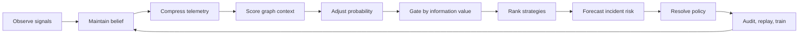

# SRE Control Primitives Extracted From GAN Matchmaking

This document captures the transferable engineering value of the nine
matchmaking / rating / decision mechanisms. In this repository, "GAN" means
the game-style matchmaking system, not generative adversarial networks.

The goal is compounding SRE capability: once a primitive is named,
instrumented, tested, and replayable, it can be reused across release
control, rollback decisions, capacity changes, alert triage, inspection
throttling, and incident routing.

## 1. Core Abstraction

The nine mechanisms collapse into one reusable control loop:



The reusable pattern is:

1. Turn raw events into durable belief.
2. Compress noisy signals without hiding their trace.
3. Add topology and context before scoring.
4. Filter actions that cannot teach the system.
5. Choose an action with a declared objective.
6. Gate the choice with time-bound risk.
7. Persist the decision so the next loop improves.

## 2. Primitive Catalog

The code-level catalog lives in `gan_matchmaking/sre/primitives.py`.

| Mechanism | SRE Primitive | Runtime Stage | Reusable Capability |
| --- | --- | --- | --- |
| TrueSkill | `belief_state_estimator` | `observe_release` | Keep a reliability belief with uncertainty, not just a point score. |
| EOMM | `objective_aware_strategy_ranker` | `stage.eomm` | Rank rollout strategies by expected retention of the SLO objective. |
| Dynamic K | `adaptive_gain_scheduler` | `stage.adjusted_probs` | Reduce aggressiveness as apparent success streak grows. |
| PCA | `latent_signal_compressor` | `stage.pca` | Compress high-cardinality telemetry into a stable latent signal. |
| GNN | `graph_blast_radius_scorer` | `stage.synergy` | Make dependency and co-release history influence local risk. |
| Handicap | `risk_adjusted_probability_scorer` | `stage.adjusted_probs` | Penalize optimistic probabilities with context like streaks and blast radius. |
| Entropy | `information_value_gate` | `stage.entropy` | Prefer actions that produce useful signal under uncertainty. |
| Cox Survival | `time_to_incident_forecaster` | `stage.risk` | Estimate probability of failure within an operational horizon. |
| Minimax BP | `adversarial_policy_arbitrator` | auxiliary | Balance competing objectives against worst-case response. |

## 3. What Each Primitive Buys SRE

### Belief State Estimator

TrueSkill gives SRE a service reliability memory:

- Input: release outcome, prior `mu/sigma`, streaks.
- Output: updated belief and confidence lower bound.
- Reuse: service health score, deploy confidence, auto-rollback trust,
  inspection skip rate.
- Boundary: do not treat `mu` as truth; `sigma` is the part that keeps the
  system honest under sparse evidence.

### Objective-Aware Strategy Ranker

EOMM is not "make the user stay" in the SRE mapping. It is "choose the
action most likely to preserve the operational objective."

- Input: history vector, candidate strategy features, optional artifact.
- Output: chosen candidate, score table, artifact/fallback source.
- Reuse: rollout strategy, remediation action selection, alert routing.
- Boundary: without artifact provenance, it becomes an opaque heuristic;
  keep `trace.stages.eomm.source` visible.

### Adaptive Gain Scheduler

Dynamic K is a brake on overconfidence:

- Input: success streak and gain parameters.
- Output: update/decision gain.
- Reuse: reduce rollout size after repeated success, slow auto-tuning after
  stability streaks, avoid overreacting to easy wins.
- Boundary: success streak is not independence. Pair this with entropy and
  graph context before making policy.

### Latent Signal Compressor

PCA turns telemetry noise into a compact signal while keeping the raw key
order traceable:

- Input: telemetry vector and current reliability belief.
- Output: hidden norm, fused score, key ordering.
- Reuse: metric bundle summarization, anomaly pre-filtering, release health
  scoring, noisy alert clustering.
- Boundary: latent dimensions explain variance, not causality.

### Graph Blast-Radius Scorer

GNN-style graph scoring makes dependency memory part of local decisions:

- Input: dependency graph, co-release history, node features.
- Output: dependency score and graph context.
- Reuse: dependency-aware deployment gates, capacity change risk, incident
  routing through upstream/downstream relationships.
- Boundary: current implementation is lightweight; for production graph
  scale, the primitive should be backed by a real graph store or feature
  service.

### Risk-Adjusted Probability Scorer

Handicap converts context into a penalty before probability is trusted:

- Input: service rating, candidate rating, penalty context.
- Output: adjusted success probability.
- Reuse: canary size adjustment, change-risk scoring, operator confidence
  discounting.
- Boundary: the penalty is policy. Tune it with replay, not taste.

### Information Value Gate

Entropy asks whether an action can still teach the system:

- Input: candidate probabilities and entropy threshold.
- Output: acceptable candidates and fallback marker.
- Reuse: canary usefulness filtering, synthetic check scheduling, alert
  enrichment decisions.
- Boundary: rejecting low-information actions should not reject mandatory
  safety actions; hard policy still wins.

### Time-To-Incident Forecaster

Cox survival makes risk horizon explicit:

- Input: runtime risk features, horizon, optional artifact.
- Output: incident probability and risk level.
- Reuse: rollback timing, freeze-window decisions, capacity change risk,
  burn-rate-to-action gates.
- Boundary: Cox coefficients are only as good as the event definition and
  feature contract; artifact manifest validation is part of the primitive.

### Adversarial Policy Arbitrator

Minimax BP is not yet the main runtime path, but it is the right shape for
conflicting objectives:

- Input: payoff matrix and objective weights.
- Output: mixed strategy and game value.
- Reuse: feature velocity vs SLO risk, capacity cost vs latency, alert
  recall vs noise.
- Boundary: do not put it in the hot path until payoff construction is
  auditable and replay-tested.

## 4. Production Readiness

| Status | Primitive |
| --- | --- |
| Production-shaped | belief state, adaptive gain, latent compression, risk-adjusted probability, information value |
| Mixed | objective-aware strategy ranker, graph blast-radius scorer, time-to-incident forecaster |
| Research / auxiliary | adversarial policy arbitrator |

The difference is not mathematical sophistication. It is whether the
primitive has stable inputs, explicit fallback, trace visibility, tests,
and runbook coverage.

## 5. Transfer Template

To reuse the pattern in another SRE domain, define this contract first:

| Field | Question |
| --- | --- |
| State | What belief should survive process restarts? |
| Signal | Which raw observations feed the belief? |
| Candidate | What actions can the controller choose? |
| Objective | What metric is being retained or protected? |
| Gate | Which hard rules override model optimism? |
| Horizon | What time window makes risk actionable? |
| Artifact | Which trained weights can change behavior? |
| Trace | Which fields prove why the decision happened? |
| Replay | Which fixtures protect this behavior forever? |

Only after those are named should the algorithm be picked. The algorithm is
an implementation detail of the primitive.

## 6. Compounding Loop

The SRE compounding path is:

```text
decision -> trace -> audit row -> replay fixture -> training corpus
         -> artifact -> manifest validation -> runtime hydrate -> decision
```

Every pass should improve one of these assets:

- a richer trace field;
- a better replay fixture;
- a stricter artifact contract;
- a safer fallback;
- a clearer runbook;
- a more calibrated threshold.

That is the real engineering output of the GAN mapping: not a single
decision model, but a repeatable way to make SRE control loops safer each
time they operate.
