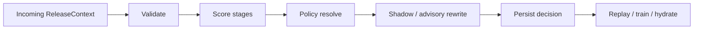
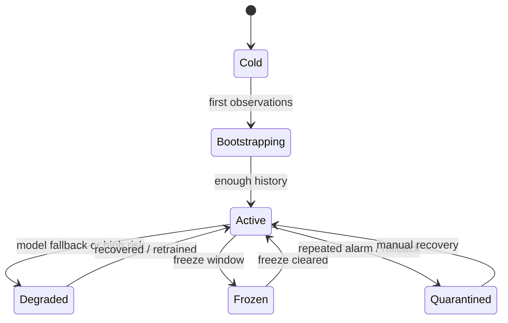
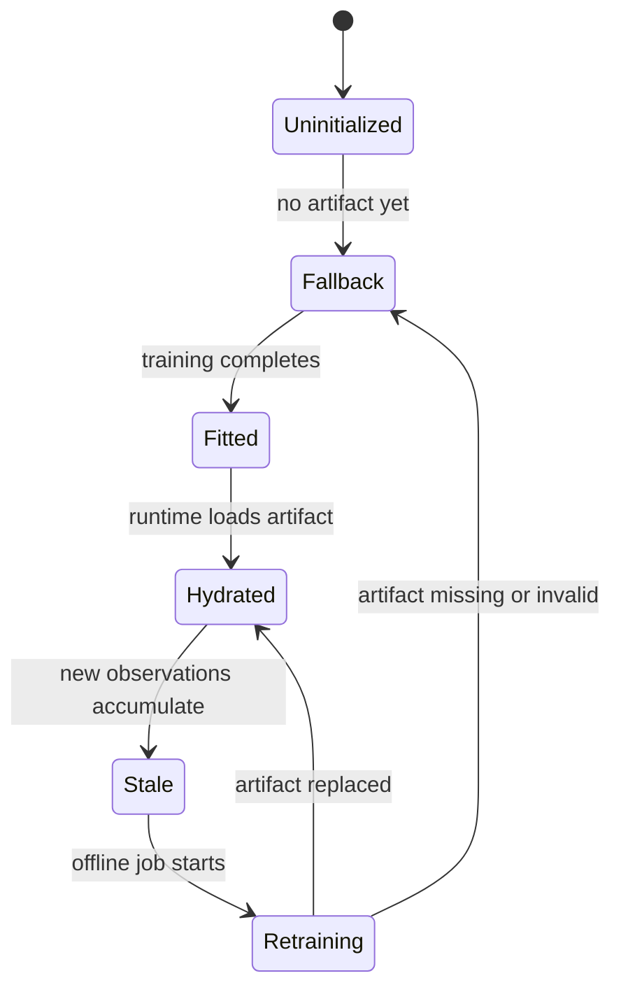
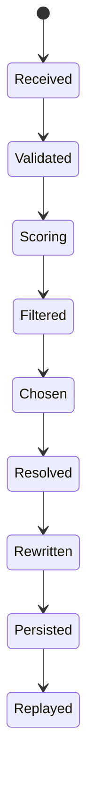
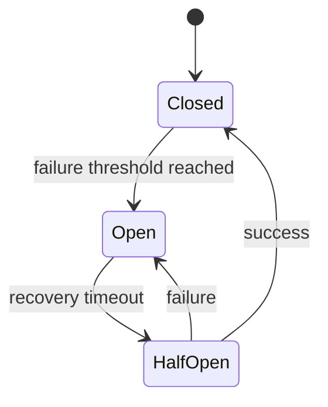
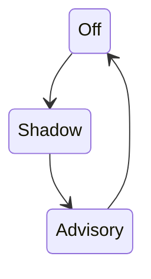

# State Lifecycle

This document describes the state machines that make the SRE self-
iteration loop safe and replayable. The architecture is not just a set of
modules; it is a set of controlled state transitions.

## 1. Why this matters

The most important questions in review are usually state questions:

- What state was the service in?
- Was the model fitted or falling back?
- Did the breaker allow the call?
- Was shadow mode rewriting the result?
- Which state transition caused the final decision?

## 2. High-level flow

## 3. Service lifecycle

### Service state ownership

- `sre/domain.py` stores the mutable service belief.
- `observe_release()` mutates `mu`, `sigma`, streaks, and counts.
- `persistence/services` is the source of truth for durable state.

### Service state signals

- `mu` and `sigma` indicate reliability belief and uncertainty.
- `win_streak` and `loss_streak` drive cadence-sensitive policy.
- `total_releases` indicates whether the service is bootstrapped.

## 4. Model lifecycle

### Model ownership

- `training/retention.py` owns the retention artifact generation.
- `training/cox.py` owns the Cox artifact generation.
- `docs/adr/0006-runtime-artifact-versioning.md` defines the metadata
  required to tell fitted, fallback, and stale apart.

## 5. Decision lifecycle

### Decision transition rules

| Transition | Trigger | Owner |
| --- | --- | --- |
| Received -> Validated | `ReleaseContext.validate()` | `sre/domain.py` |
| Validated -> Scoring | breaker allows + lock acquired | `sre/self_iteration.py` |
| Scoring -> Filtered | entropy stage completes | `entropy_match.py` |
| Filtered -> Chosen | EOMM argmax / fallback tie-break | `eomm.py` + pipeline |
| Chosen -> Resolved | risk policy applies | `sre/self_iteration.py` |
| Resolved -> Rewritten | shadow mode boundary | `sre/shadow.py` |
| Rewritten -> Persisted | store is available | `persistence/` |
| Persisted -> Replayed | replay runbook / regression test | `docs/runbooks/reproduce-decision.md` |

## 6. Breaker lifecycle

### Breaker semantics

- `Closed`: normal operation.
- `Open`: short-circuit to escalation.
- `HalfOpen`: one test call is allowed.

The breaker is not a model; it is a control safeguard around the whole
decision path.

## 7. Shadow lifecycle

### Shadow semantics

- `off`: enforce returned decision.
- `shadow`: force boundary output to `HOLD` but keep internal trace.
- `advisory`: return the decision, but annotate it as informational.

## 8. Observable state fields

These fields should be enough to reconstruct the logical state of a
decision:

- `correlation_id`
- `service_id`
- `decision.kind`
- `decision.risk_level`
- `decision.confidence`
- `trace.stages.*`
- `shadow_mode`
- `breaker.state`
- `artifact_version` once runtime artifact versioning is fully wired

## 9. Boundary Rules

- Validation failure stops before scoring.
- Freeze window stops before policy optimism.
- Error budget exhaustion biases to hold / rollback.
- Unfit models must degrade deterministically.
- Shadow rewrite must remain visible in trace.

## 10. What to Add Next

1. persist artifact metadata with every decision
2. record explicit model lifecycle state in trace
3. make replay tooling assert lifecycle transitions, not just final kind
